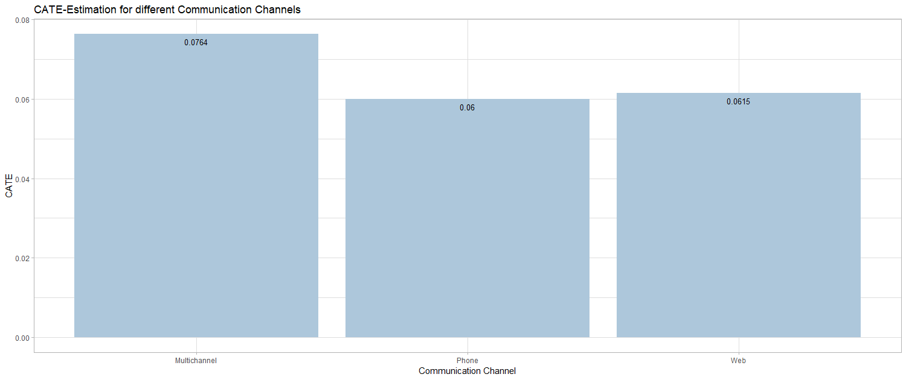

+++
title = "Causal KNN"
date = '2019-08-01'
tags = [ "Causal Inference", "Class19", "Causal Inference", "Uplift Modelling", "KNN Algorithm",]
categories = ["Course Projects"]
banner = "img/seminar/sample/hu-logo.jpg"
author = "Maximilian Kricke, Tim Peschenz"
disqusShortname = "https-humbodt-wi-github-io-blog"
description = "Blog Post for Seminar Applied Predictive Analytics"
+++

# Applied Predictive Analytics Seminar - Causal KNN 


## Abstract 
Beyond estimating the overall effect of a treatment, the uplift, econometric and statistical literature have set their eyes on estimating the personal treatment effect for each individual. This blogpost highly relates to the paper of Hitsch & Misra (2018), where an uplift modeling approach is introduced, called Causal KNN. The k-nearest neighbor algorithm provides an interesting opportunity for the estimation of treatment effects in small groups. <!--Additional tweaks to the parameter tuning procedure make the approach to an interesting case study in the extension of machine learning concepts to causal modeling in general.--> The Causal KNN algorithm provides a simple and effective framework for the direct estimation of the Conditional Average Treatment Effect (CATE). Furthermore, the Transformed Outcome, described in Athey and Imbens (2015b), is used for the parameter tuning and evaluation of Uplift Models. The Causal KNN Algorithm is presented in an application framework, using a real world data set from an E-Mail marketing campaign.

## Motivation(Max):
  - Anwendungsbereiche "Treatment Effect"
  - Use Case: "Business Evaluation":
    - Potential Outcome Framework (Rubin 2015) 
    - Targeting Cost Discussion: Klare Abgrenzung von der Diskussion der Targeting Cost (-> Verweis auf entsprechende Literatur) 
    - Micro-Marketing Context (due to computational restrictions) 

## Summary of the Literature Foundation (Tim)
This blogpost has strong relations to the work of Hitsch & Misra (2018). A key goal of their paper is to compare many different estimates of different optimal targeting policies, using the inverse probability weighted profit estimator. 

Causal Inference is done in the potential outcome framework. This framework will be briefly explained in the following. Assume a company is about to run an E-Mail campaign. Therefore, the company needs to decide on the amount of people that will receive an E-Mail. This decision depends on the cost of the campaign compared to the expected revenue. On a customer level, this decision boils down from the comparison of the targeting effort cost to the incremental profit contribution of each customer. The fundamental problem of treatment effect analysis is, that it can not be observed, whether the customers action was influenced by the received targeting or not. It can not be observed how a treated customer would have acted when he or she would not have received such an E-Mail. Therefore we aim at identifying the underlying factors of the customers behaviour, to eliminate these effects for the calculation of the treatment effect estimation. A given targeting policy cannot be directly evaluated in a randomized sample, because for many customers the proposed treatment assignment by the targeting policy will differ from the realized treatment assignment. However, for units where both, the proposed and realized treatment assignment agree, we can scale the realized profit contribution by the inverse of the propensity score to account for the percentage of similar units that are "missing", in the sense that the proposed and realized treatment assignment are different. This problem can be described via the following graphic:





C:\Users\timpe_000\Desktop\blog\docs\img\seminar\causal_knn


The aim of this paper is to explain estimation methods that directly predict the individual incremental effect of targeting. 

To evaluate the treatment effect estimations, there are multiple approaches in the marketing literature (cite!). The observed data set consists of the observations , where  is the number of customers,  is the target variable,  the binary treatment variable (0,1) and  represents the covariates vor each unit. 

* Average Treatment effect: 
* Average Treatment effect on the treated: 
* Conditional Average Treatment effect: 

where  and  is the observed outcome for the treated () and the untreated () customers and  is the vector of observed customer features. According to Hitsch and Misra (2018) an optimal policy targets a customer if and only if \mathbb{E}[\pi(0)|X_i]$" style="border:none;">, which means that the expected profit in case of targeting exceeds the expected profit in case the customer i is not targeted. This expression can be reformulated to: 

 0$" style="border:none;">


0$" style="border:none;">


Here,  is the conditional average treatment effect (CATE): . The CATE describes the average causal effect of targeting for a sub-population of customers, with identical features. It is shown in Hitsch, Misra (2018), that the CATE is sufficient to identify an optimal targeting policy, but generally the CATE can not be inferred from the data. To account for the fundamental problem of unobservable individual treatment effects, Hitsch and Misra (2018) introduced three assumptions to the data, to be able to identify the CATE. If the data satisfies the following assumptions, the conditional average treatment effect is identifiable from the data.

1.  Unconfoundedness:  
It means, that ones individuals outcome does not depend on the treatment conditional on X. 'The treatment effect is identical within a subset of customers with identical features.' This condition can be fulfilled by using a randomized sample set. In marketing, it is often possible to address campaigns randomized, therefore this condition should be satisfied in general. 
2.  The Overlap Assumption: . The propensity score  is the probability of being targeted, conditional on the customers features and can be translated as the 'Targeting Probability' for each unit. This targeting probabilty has to be defined strictly between zero and one.
3.  Stable Unit Treatment Value Assumption (SUTVA): The treatment received by customer i, , has no impact on the behavior of any other customer. There are no social interaction or equilibrium effects among the observed units. According to Hitsch (2018), the SUTVA assumption should be satisfied in general. It appears implausible to observe economically significant social effects due to the receipt of e.g. a catalog.   

If those three assumptions are satisfied, we obtain the following formula to calculate the 'true' conditional average treatment effect:


### Identification of conditional average treatment effects

It is still unrealistic to assume that we have more than one customer with exactly the same feature set, especially in high dimensional data with many feature variables. We can find this sitiuation especially in big data applications, where units are characterized with a vast amount of features. Therefore we need to account for the heterogeniety among the customers in the data set. The proposed approach to identify thse observations, which are similar to each other, is k-nearest neighbours.

To estimate the conditional average treatment effect, we will use a direct approach. Such methods appear to be infeasible since we are restricted by the fundamental problem of causal inference. Having the fundamental problem in mind, we will discuss an estimation method to approximate the unobservable CATE. It is genrally considered, that the conditional average treatment effect cannot be inferred from the data. Nevertheless, using a combination of knn-Clustering and the transformed outcome approach, we are able to build an estimate that is asymptotically equivalent and unbiased to the "true" CATE.

The proposed approach from Hitsch and Misra (2018) allows to evaluate the profit of several different targeting policies, by using only one single randomized sample. This offers the opportunity to compare various targeting policies, without the need for multiple field experiments. According to Hitsch and Misra (2018), an optimal targeting policy has to concentrate on the binary treatment case, where every unit is either treated or not and that a unit is only treated, if the incremental value of the treatment exceeds the targeting costs. Hitsch and Misra (2018) introduce their approach as a direct estimation method. Direct estimation methods focus on measuring and predicting the treatment effect of certain actions. This is based on the squared difference between the true and the estimated treatment effect for each unit i: . Opposed to direct estimation approaches, where the focus lies on estimating the treatment effect itself, indirect estimation methods concentrate on the observed and the predicted outcome levels. To dicide for an optimal targeting policy, the squared error loss between the two outcome levels are minimized: . Therefore the indirect approaches focus on the outcome levels instead on the treatment effect itself. Hitsch and Misra (2018) describe the indirect approaches as conceptually wrong in the field of uplift estimation. They recommend the usage of direct estimation methods, since they yield at more accurate estimations of the treatment effect. The Causal KNN estimation, combined with the transfomed outcome, can be used to derive an approximation of the CATE for each observation in a data set.


## The Causal KNN Algorithm(Tim)
  - Algorithm
  - Application: Visit (Spend auch möglich, aber zu unbalanced Data)
  - Implementation (Vorstellung "FNN-Package")
  - Einordnung als Two-Model-Approach & Direct Estimation Method (vgl. Hitsch)
  
### Causal KNN Estimation
As mentioned before, the true CATE is not observable. Hitsch and Misra use a method to approximate the actual treatment effect via the transformed outcome Y\*. To overcome the fundamental problem of treatment effect estimation, the Causal KNN algorithm is used. This approach allows to derive an estimation of the CATE on an individual unit level. The Causal KNN approach is described as a direct estimation method. 
The algorithm first starts with selecting the k treated and untreated nearest neighbours for each observation. The nearest neighbours are selected, based on the covariates, using the euclidean distance measure. However, every other distnce measure would be similarily feasible, depending on the application framework. Afterwards, the individual treatemnt effects are derived by computing the differences between the mean outcome values of the treated and the untreated nearest neighbours for all units. This yields at an estimation of the CATE for each observation in the data set. This procedure is represented in the following equation: , where  represents the outcome values of the target variable and  and  denote the nearest neighbour units with treatment status  and  respectively. Since the Causal KNN algorithm takes the number of nearest neighbours k as a freely selectable parameter, it is necessary to find a way to choose the optimal k value.
<!-- These methods select the tuning parameter K using a feasible loss that, in expectation, attains its minimum at the same K value as the infeasible loss based on the treatment effect. 
For any vector x, we find the K nearest *treated* neighbors and separately the K nearest *untreated* neighbors. We then estimate the CATE using the difference between the nearest treated and untreated units:
$\widehat{\tau_K}(x)= \frac{1}{K} \sum_{i \in N_K(x,1)} Y_i - \frac{1}{K}  \sum_{i \in N_K(x,0)} Y_i$.-->
                                                                                                       
### Comparison of Causal KNN and the Two-Model-Approach
According to Rzepakowski and Jaroszewicz (2012/2), the idea behind the two model approach is to build two separate models to estimate the treatment effect. One Model is trained, using the treatment, and the other one using the control data set. After building the two models, the treatment effect estimations are calculated by subtracting the predicted class probabilities from the control model from those of the treatment model. This yields at a direct estimation of the difference in the outcome, caused by the treatment. The advantage of the two model approach is that it can be applied with any classification model (Rzepakowski and Jaroszewicz, 2012). A possible problem that might arise with this approach, is that the uplift might be differently from the class distributions. In this case, the models focus on predicting the class, rather than the uplift.
The Causal KNN ALgorithm also calculates the difference between the predicted outcomes of the treated and untreated observations in a data set. The number of observations that are taken into account, is limited by the KNN parameter K. Therefore, the Causal KNN algorithm itself can be possibly seen as a special case of the two model approach. An important aspect of the described method here, is the usage of the transformed outcome, for the tuning of the causal KNN model. Since the combination of causal KNN and the transformed outcome allows to calculate the CATE estimations directly, it is not appropriate to completely assign this to the group of two model approaches. According to Rzepakowski and Jaroszewicz (2012/2), the two model approach is different from the direct estimation methods, since it focuses on predicting the outcome of the target variable to estimate the treatment effect, rather than predicting the treatment effect itself. As already shown above, the Causal KNN algorithm should be rather categorized as a direct estimation approach (Hitsch and Misra, 2018) and should therefore not be seen as a two model approach.


## Data Presentation
For the application of the presented methodology, data from an E-Mail targeting campaign was used, including 64,000 observations. The data entries represent customer transactions with serveral corresponding variables. The treatment variable "segment" originally includes three possible values, E-Mail for Women, E-Mail for Men and No E-Mail. There are three different target variables. "Visit" as the visitation of the companies website and "Conversion" of the customer are binary variables. The numeric variable "Spend" represent the amount of money spend by a customer in the following two weeks after the campaign. 
There are various covariates that characterize customers according to their personal properties and purchasing behaviour. The "Recency" represents the month since the last purchase was made. "History" and "History_Segment" include information about the amount of money spend in the last year, in dollars. "Mens" and "Womens" are binary variables that indicate whether a customer bought products for men or for  women. The "Zip_Code" includes geographical information, grouped into Urban, Suburban and Rural regions. "Newbie" states whether a person was registered as a new customer in the past 12 month and the Channel represents on which ways a customer placed orders, i.e. via phone, mail or both. To provide a comprehensive overview about the data, an example table is presented, including first observations of the data set.

```r
###load data
library(readr)
data = read_csv("../Data/mail_data.csv")

head(data)
```

recency | history_segment | history | mens | womens | zip_code  | newbie | channel | segment       | visit | conversion | spend | idx | treatment
------- | --------------- | ------- | ---- | ------ | --------- | ------ | ------- | ------------- | ----- | ---------- | ----- | ----- | ---------
10      | 2) $100 - $200  | 142.44  |  1   |   0    | Surburban |  0     | Phone   | Womens E-Mail | 0     | 0          | 0     | 1 | 1
6       | 3) $200 - $350  | 329.08  |  1   |   1    | Rural     |  1     | Web     | No E-Mail     | 0     | 0          | 0     | 2 | 0
7       | 2) $100 - $200  | 180.65  |  0   |   1    | Surburban |  1     | Web     | Womens E-Mail | 0     | 0          | 0     | 3 | 1
9       | 5) $500 - $750  | 675.83  |  1   |   0    | Rural     |  1     | Web     | Mens E-Mail   | 0     | 0          | 0     | 4 | 1
2       | 1) $0 - $100    | 45.34   |  1   |   0    | Urban     |  0     | Web     | Womens E-Mail | 0     | 0          | 0     | 5 | 1
6       | 2) $100 - $200  | 134.83  |  0   |   1    | Surburban |  0     | Phone   | Womens E-Mail | 1     | 0          | 0     | 6 | 1


### Data Preparation

```{r, echo = FALSE, eval = FALSE, include = TRUE}
#convert to data frame
data = as.data.frame(data)
str(data)
```

After importing the e-mail data set, the non-numeric variables are converted into factors. Afterwards, all columns are examined with regard to missing values. There are no missing observations in the data set. Therefore, an imputation of missing values is not necessary for none of the variables.

```{r, eval = FALSE, include = TRUE}
###data type
#history_segment as factor
data$history_segment = as.factor(data$history_segment)
levels(data$history_segment)

table(data$history_segment)

#zip code as factor
data$zip_code = as.factor(data$zip_code)
levels(data$zip_code)

table(data$zip_code)

#channel as factor
data$channel = as.factor(data$channel)
levels(data$channel)

table(data$channel)

#segment as factor
data$segment = as.factor(data$segment)
levels(data$segment)

table(data$segment)


###check for NA values in the data set
sapply(data[,1:ncol(data)], FUN = function(x){sum(is.na(x))})
```

To label the different observations in the data set, an index column was added, in order to be able to reassign all observations in the later steps of the analysis. The original data set contains three outcomes for the treatment variable, i.e. E-Mail for Women, E-Mail for Men and no E-Mail. Since the analysis is designed to deal with binary treatment variables, the three possible treatment values are reduced to either receiving an E-Mail or not. For the further process of the analysis, the binary treatment variable indicates solely whether units received a treatment. There is no distinction anymore between E-Mails for Women and Men. Since the different treatments were randomly assigned with the same probability, the aggregation of the treatment yields at a propensity score of 2/3 for each individual. Therefore, the treatment assignment in the data set is slightly unbalanced. Since the difference between the number of treated and untreated customers is not too high, the unbalancedness should not cause any problems for the proposed method. For extremely unbalanced data, the causal KNN algorithm might not work, because it might be impossible to find sufficiently much treated or untreated nearest neighbours.
The KNN algortihm picks the nearest neighbours by calculating the euclidean distances between target variable outcomes of different units. Therefore, the method can only deal with numeric variables. To meet this requirement, the non-numeric covariates are transformed into dummy variables, using the mlr package.

```{r, eval = FALSE, include = TRUE}
###preparation of the data set
#adding index column
data$idx = seq(1:nrow(data))

#adding binary treatment column
data$treatment = sapply(data$segment, FUN = function(x) ifelse(x == "No E-Mail", 0, 1))

#create dummy features
library(mlr)

data_d = createDummyFeatures(data, target = "visit")
colnames(data_d)
```


### Causal KNN Algorithm Implementation

The Causal KNN alorithm starts with selecting the k treated and untreated nearest neighbour observations for each unit i. To allow a simple selection of both groups, the data set is separated into two data frames, containing the treated and untreated observations respectively.

```{r, eval = FALSE, include = TRUE}
#select data partition for training
data_d = data_d[1:10000, ]

###splitting data set
#1 no treatment
data_nt = data_d[which(data_d$segment.No.E.Mail == 1),]

#2 treatment
data_t = data_d[which(data_d$segment.No.E.Mail == 0),]

#checking target variables
sum(data_d$visit != 0)
sum(data_d$conversion != 0)
sum(data_d$spend != 0)
```

The KNN search is realized by using the FNN package in R. This package allows to extract the index values of the nearest neighbours for each observation and the corresponding distances. An important aspect of causal KNN is to find the optimal k value for a specific application setting. To check for several values of k, it is necessary to specify the maximum number of nearest neighbours that is going to be tested. The possible k value is restricted by the minimum total number of treated or untreated observations, i.e. the minimum number of rows of the data frames with the two treatment groups. A very useful feature of the FNN package, is the possibility to specify different data sets for the search space and the observations, for which nearest neighbours have to be found. This allows to conduct an simple search for nearest neighbours among the treated and untreated observations. There are two data frames resulting from both steps of the search process. The treated_nn data frame includes the nearest neighbours with treatment status 1 and untreated_nn those with treatment status 0. These two data sets build the basis for the next step of the algorithm, i.e. the identification of the optimal k value.

```{r, eval = FALSE, include = TRUE}
###Causal KNN
#install.packages("FNN")
library(FNN)

#setting parameter k for number of nearest neighbours
k = 3000
k = k + 1

#select columns to be eliminated for nearest neighbour search
drop_cols = c("visit", 
              "spend", 
              "conversion", 
              "idx", 
              "treatment", 
              "segment.Mens.E.Mail",
              "segment.Womens.E.Mail",
              "segment.No.E.Mail")

#garbage collection to maximize available main memory
gc()

#available memory im Mb
memory.limit()

#set memory limit
#memory.limit(size = 50000)

#calculate indices of k treated nearest neighbours
treated_nn = get.knnx(data_t[, !(names(data_t) %in% drop_cols)], 
                      query = data_d[, !(names(data_d) %in% drop_cols)], 
                      k = k)
treated_nn = data.frame(treated_nn$nn.index)

#deleting first column
treated_nn = treated_nn[, 2:ncol(treated_nn)]

treated_nn[1:10, 1:10]

#calculate indices of k untreated nearest neighbours
untreated_nn = get.knnx(data_nt[, !(names(data_nt) %in% drop_cols)], 
                        query = data_d[, !(names(data_d) %in% drop_cols)], 
                        k = k)
untreated_nn = data.frame(untreated_nn$nn.index)

#deleting first column
untreated_nn = untreated_nn[, 2:ncol(untreated_nn)]

untreated_nn[1:10, 1:10]

#checking results
data_d$treatment[data_t$idx[unlist(treated_nn[1,][1:30])]]
data_d$treatment[data_nt$idx[unlist(untreated_nn[1,][1:30])]]


#replacing index values
treated_nn = sapply(treated_nn, FUN = function(x){
  data_t$idx[x]
})

untreated_nn = sapply(untreated_nn, FUN = function(x){
  data_nt$idx[x]
}) 

treated_nn[1:10, 1:10]
untreated_nn[1:10, 1:10]

#transpose data frames
treated_nn = t(treated_nn)
untreated_nn = t(untreated_nn)
```

To estimate a robust CATE, we would likely use all customers in the neighborhood. A high value for K increases the accounted neighborhood, while it decreases the similarity between the customers. Therefore, the estimation depends on the choice of K. To find an optimal value of K, we want to minimize the squared difference between  and the transformed outcome Y\*. This is called the 'Transformed Outcome Approach', which will be described in the following.


## Transformed Outcome Approach

Vorstellung "Transformed Outcome Approach" (Max)
Rechtfertigung (Mathematisch + Intuitiv)

- "Transformed Outcome Approach" (Max)
  - Justification


In order to tune the parameter k, we are using the transformed outcome loss, which is a proxy for the true conditional treatment effect. The transformed outcome is defined as: 


Since it only depends on the potential outcome that corresponds to the realized treatment level, the transformed outcome can be calculated from the observed outcome : 


Since we are having a formula for the predicted outcome, we still need to decide on the actual outcome. 
For a randomized sample, the propensity score  is not relevant, since it is accounted in every individuals treatment effect in the same manner. 
It can be shown that, under unconfoundedness, the transformed outcome is an unbiased estimator for the actual treatment effect. 

### Intuitive Interpretation of the transformed Outcome

### Intuitive Interpretation of the mean squared error loss

### Explanation, why an optimal choice of K is sufficient

### Parameter Tuning using the Transformed Outcome

An essential part of the causal KNN algorithm is the parameter tuning to specify the k value, that leads to the most accurate treatment effect estimations. For the parameter tuning, several values for k are tested and different CATE estimations are stored in a separate data frame. To derive estimations for all observations in the data set, the differences of the mean outcome variable values of the k treated and untreated nearest neigbours are calculated. Several iterations of this precedure yield at a data frame, containing the individual uplift estimations for different values of k. To select the most accurate estimation, the transformed outcome is used to decide for a preferable k value.

```{r, eval = FALSE, include = TRUE}
###parameter tuning to find optimal k value
#setting parameters for the number of neigbours
k_start = 100
k_end = 3000
steps = 100

#creating sequence of k values to test for
k_values = seq(from = k_start, to = k_end, by = steps)
length(k_values)

#preparing uplift data frame
uplift = data.frame("idx" = data_d$idx,
                    "treatment" = data_d$treatment)

#calculating uplift for specified k values
for (k in k_values) {
  reaction_nt = apply(untreated_nn, MARGIN = 2, 
                      FUN = function(x){
                        mean(data_d$visit[x[1:k]])
                        }
                      )
  
  reaction_t = apply(treated_nn, MARGIN = 2, 
                     FUN = function(x){
                       mean(data_d$visit[x[1:k]])
                       }
                     )
  
  uplift[paste("uplift_",k, sep = "")] = reaction_t - reaction_nt
  
  print(paste("k = ", k))
}

#check result
uplift[1:10, ]
```

## Transformed Outcome Loss Calculation

After calculating the various uplift estimations by varying the tuning parameter k, the transformed outcome, as proxy for the "true" CATE, is constructed. The calculation of the transformed outcome needs the propensity score, the treatment status and the original value of the target variable. By using the formula introduced in the theory section, the transformed outcome can be easily calculated for the actual target variabe visit. To decide on a value of k, the transformed outcome loss is calculated for each potential k value, by computing the mean squared difference between the transformed outcome and the various treatment effect estimations. The estimation that yields at the minimal value of the transformed outcome loss indicates the most accurate value for k, as shown by Hitsch and Misra (2018). The following plot was created to depict the development of the outcome loss with varying k values. When increasing the number of nearest neighbour observations that are taken into account, the accuracy of the CATE estimation increases in the beginning. However, when increasing k over a certain level, the heterogeniety among the nearest neighbours increases to strongly. That leads to less accurate estimations of the treatment effects. 

```{r, eval = FALSE, include = TRUE}
###transformed outcome
#propensity score
e_x = mean(data_d$treatment)
e_x

#function for transformed outcome
transformed_outcome = function(e_x, w_i, target){
  return(((w_i - e_x)/(e_x*(1-e_x)))*target)
}

#apply function on all observations
trans_out = sapply(uplift$idx, FUN = function(x){
  transformed_outcome(e_x = e_x, 
                      w_i = data$treatment[x], 
                      target = data$visit[x])
})

trans_out[1:50]
data$treatment[1:20]
data$visit[1:20]

uplift$trans_out = trans_out
rm(trans_out)

#transformed outcome loss
outcome_loss = data.frame("k" = k_values, "loss" = 0)

#find optimal k value from transformed outcome loss
for (i in 1:length(k_values)){
  outcome_loss[i, 2] = mean((uplift$trans_out - 
                               uplift[, i + 2])^2)
}

outcome_loss

#find minimal outcome loss value
min(outcome_loss$loss)

outcome_loss$k[which.min(outcome_loss$loss)]

plot(outcome_loss$loss, type="b")

#plot result
library(ggplot2)

k_plot = ggplot(data = outcome_loss) +
  geom_point(aes(x = outcome_loss$k, 
                 y = outcome_loss$loss), 
             size = 2, shape = 18) +
  geom_point(aes(x = outcome_loss$k[which.min(outcome_loss$loss)], 
                 y = min(outcome_loss$loss)), 
             size = 4, shape = 18, color = "red") +
  geom_text(aes(x = outcome_loss$k[which.min(outcome_loss$loss)], 
                y = min(outcome_loss$loss)), 
            label = paste("K = ", outcome_loss$k[which.min(outcome_loss$loss)]), 
            color = "black", size = 4, nudge_x = 120, check_overlap = TRUE) +
  stat_smooth(data = outcome_loss, 
              aes(x = outcome_loss$k, y = outcome_loss$loss), 
              method = "loess", se = FALSE, span = 0.1) +
  labs(title="Parameter Optimization of Causal-KNN CATE-Estimation", 
       x ="Value of K", y = "Outcome Loss Value") +
  theme_light()

k_plot
```


After finding the most accurate estimation of the CATE, it is possible to extract valuable insights from the data. This information kann be used to plan targeting policies for future campaigns. Since the Causal KNN algorithm delivers treatment effect estimation on an individual level, it is easily possible to extract several other treatemnt effect measures. The average treatment effect (ATE) and the average treatment effect on the treated(ATT) can be derived. Furthermore, different CATE estimations based on different dimensions of the data can be calculated by grouping the observations.

```{r, eval = FALSE, include = TRUE}
#extract best uplift estimation
data_d$uplift = uplift[, paste0("uplift_", outcome_loss$k[which.min(outcome_loss$loss)])]
data_d$uplift[1:20]

#ATE
ate = mean(data_d$uplift)
ate

#ATT
att = aggregate(data_d$uplift, by=list(data$treatment[1:nrow(data_d)]), FUN=mean)
att

#CATE
cate_sex = aggregate(data_d$uplift, by=list(data$mens[1:nrow(data_d)]), FUN=mean)
cate_sex

cate_hist_seg = aggregate(data_d$uplift, by=list(data$history_segment[1:nrow(data_d)]), FUN=mean)
cate_hist_seg

ggplot(data = cate_hist_seg, aes(x = Group.1, y = x)) +
  geom_bar(stat = "identity", fill = "#adc7db") +
  labs(title="CATE-Estimation for different History Segments", x ="History Segment", y = "CATE") +
  theme_light() +
  geom_text(aes(label = round(x, digits = 4)), vjust = 1.6, color = "black", size = 3.5)

cate_zip_code = aggregate(data_d$uplift, by=list(data$zip_code[1:nrow(data_d)]), FUN=mean)
cate_zip_code

cate_newbie = aggregate(data_d$uplift, by=list(data$newbie[1:nrow(data_d)]), FUN=mean)
cate_newbie

ggplot(data = cate_newbie, aes(x = Group.1, y = x)) +
  geom_bar(stat = "identity", fill = "#adc7db") +
  labs(title="CATE-Estimation for different Newbie-Status", x ="Newbie", y = "CATE") +
  theme_light() +
  geom_text(aes(label = round(x, digits = 4)), vjust = 1.6, color = "black", size = 3.5)

cate_channel = aggregate(data_d$uplift, by=list(data$channel[1:nrow(data_d)]), FUN=mean)
cate_channel

ggplot(data = cate_channel, aes(x = Group.1, y = x)) +
  geom_bar(stat = "identity", fill = "#adc7db") +
  labs(title="CATE-Estimation for different Communication Channels", x ="Communication Channel", y = "CATE") +
  theme_light() +
  geom_text(aes(label = round(x, digits = 4)), vjust = 1.6, color = "black", size = 3.5)
```


Another advantage of the causal KNN method is the high flexibility with regard to the target variable. As already shown, the algorithm works with a binary outcome variables, e.g. visit in this case. By simply exchanging the target variable with a numeric one (spend), the algorithm can be executed similarily, without further modifications to the code. The CATE estimations represent an approximation of the total uplift that is expected in the case of a treatment. Therefore, the CATE for the target variable spend indicates the expected absolute increase or deacrease of spendings for each individual, when a treatment would be assigned. The application of the Causal KNN algorithm for numeric target variables does not need further changes to the implementation, instead of changing the outcome variable from visit to spend. Therefore, the code is not provided here in the blogpost. A possible implementation can be seen here (LINK!). Although the data theoretically allow for an estimation of the CATE for the variable spend, the insights of that estimation are not that valuable, because the number of converted observations is very low. Therefore, the dataset is extremely unbalanced with regard to the variable spend. 

### Causal KNN for optimal Targeting Policy Prediction

The next section presents the causal KNN method in an application case, where a targeting policy has to be developed, based on the CATE estimations. From the model training and parameter tuning of previous steps, it was possible to find a best fitting value for the number of nearest neighbours k, that are taken into account. This value is now used in the prediction setting, where we assume that we do not know the actual outcome values. The aim is to find those individuals, where a treatment increases the value of the outcome variable the most. By specifying a fixed percentage of the population, we are able to select the most profitable individuals for a treatment assignment. The causal KNN algorithm process is similar to the one above, but without any parameter tuning. The important difference to the causal KNN estimation for the k value determination, is the change in the search space. For the test data, we assume that we did not decide for a treatment yet and do not have any information about the individual outcome values. Therefore, we are not able to calculate the transformed outcome for the test data set. Since we decided in a previous step for an optimal parameter of k, we use this value here as parameter for the causal knn algorithm. The difference is now that we do not search for treated and untreated nearest neighbours in the test data set. We are not able to do so, because we did not decide for any treatment assignment yet. We rather search the neighbours for our observations in the training data set, which we already used for finding the optimal k value. 

```{r, eval = FALSE, include = TRUE}
###using causal knn as predictive model
test_set = createDummyFeatures(data[10001:20000, ])
test_set$idx = 1:nrow(test_set)

#splitting data set
#1 no treatment
data_nt = data_d[which(data_d$segment.No.E.Mail == 1),]

#2 treatment
data_t = data_d[which(data_d$segment.No.E.Mail == 0),]


#running causal knn for test set to calculate mse
#select target columns
drop_cols = c("visit", 
              "spend", 
              "conversion", 
              "idx", 
              "treatment", 
              "segment.Mens.E.Mail",
              "segment.Womens.E.Mail",
              "segment.No.E.Mail",
              "uplift")


#setting optimal k value from the parameter tuning above
k = outcome_loss$k[which.min(outcome_loss$loss)] + 1


#calculate indices of k treated nearest neighbours
treated_nn = get.knnx(data_t[, !(names(data_t) %in% drop_cols)], 
                      query = test_set[, !(names(test_set) %in% drop_cols)], 
                      k = k)
treated_nn = data.frame(treated_nn$nn.index)

#deleting first column
treated_nn = treated_nn[, 2:ncol(treated_nn)]

treated_nn[1:10, 1:10]


#calculate indices of k untreated nearest neighbours
untreated_nn = get.knnx(data_nt[, !(names(data_nt) %in% drop_cols)], 
                        query = test_set[, !(names(test_set) %in% drop_cols)], 
                        k = k)
untreated_nn = data.frame(untreated_nn$nn.index)

#deleting first column
untreated_nn = untreated_nn[, 2:ncol(untreated_nn)]

untreated_nn[1:10, 1:10]

#checking results
data_d$treatment[data_t$idx[unlist(treated_nn[1,][1:30])]]
data_d$treatment[data_nt$idx[unlist(untreated_nn[1,][1:30])]]

#replacing index values
treated_nn = sapply(treated_nn, FUN = function(x){
  data_t$idx[x]
})

untreated_nn = sapply(untreated_nn, FUN = function(x){
  data_nt$idx[x]
}) 

treated_nn[1:10, 1:10]
untreated_nn[1:10, 1:10]

#transpose data frames
treated_nn = t(treated_nn)
untreated_nn = t(untreated_nn)

#preparing uplift data frame
uplift = data.frame("idx" = test_set$idx,
                    "treatment" = test_set$treatment)

#rownames(test_set) = 1:nrow(test_set)
#calculating uplift for specified k values

reaction_nt = apply(untreated_nn, MARGIN = 2, FUN = function(x){
  mean(data_d$visit[x[1:k-1]])
})

reaction_t = apply(treated_nn, MARGIN = 2, FUN = function(x){
  mean(data_d$visit[x[1:k-1]])
})

uplift[paste("uplift_", k, sep = "")] = reaction_t - reaction_nt


#check result
uplift[1:10, ]
```

## Application of Transformed Outcome Approach for general Uplift Models
### Causal Tree Model
The parameter tuning using the transformed outcome loss is also useful for other uplift applications. To show this, the same methodology that was applied to determine the optimal k value for the causal KNN model is here used to find optimal parameters for a causal tree. Different values for parameters are tested and evaluated by using the transformed outcome loss. The minimal outcome loss value again indicates the most favorable parameter value for the model estimation.

```{r, eval = FALSE, include = TRUE}
#using transformed outcome for tuning parameters of other models
#different cp for causal tree

#install.packages("devtools")
#library(devtools) 
#install_github("susanathey/causalTree")

library(causalTree)

#setting parameters for the complexity parameters to test for
cp_start = 0
cp_end = 0.0001
cp_steps = 0.00001

#creating sequence of k values to test for
cp_values = seq(from = cp_start, to = cp_end, by = cp_steps)
length(cp_values)

uplift_ct = data.frame("idx" = data_d$idx, "treatment" = data_d$treatment, "visit" = data_d$visit) 

#calculating uplift for specified min size values
for (cp in cp_values) {
  causal_tree = causalTree(visit~.-spend -conversion -idx -segment.Mens.E.Mail -segment.Womens.E.Mail -segment.No.E.Mail, data = data_d, treatment = data_d$treatment, split.Rule = "CT", cv.option = "CT", split.Honest = T, cv.Honest = T, split.Bucket = F, xval = 5, cp = cp, propensity = e_x)
  
  uplift_ct[paste("uplift_",cp, sep = "")] = sapply(causal_tree$where, FUN = function(x){causal_tree$frame$yval[x]})
  
  print(paste("cp = ", cp))
}

#check result
uplift_ct[1:30, ]

#calculate the transformed outcome
uplift_ct$trans_out = sapply(uplift_ct$idx, FUN = function(x){
  transformed_outcome(e_x = e_x, w_i = data_d$treatment[x], target = data_d$visit[x])
})

#transformed outcome loss
outcome_loss = data.frame("cp" = cp_values, "loss" = 0)

#find optimal cp value
for (i in 1:length(cp_values)){
  outcome_loss[i, 2] = mean((uplift_ct$trans_out - uplift_ct[, i + 3])^2)
}

outcome_loss

#find minimal value
min(outcome_loss$loss)

outcome_loss$cp[which.min(outcome_loss$loss)]

plot(outcome_loss$loss)

cp_plot = ggplot(data = outcome_loss) +
  geom_point(aes(x = outcome_loss$cp, y = outcome_loss$loss), size = 2, shape = 18) +
  geom_point(aes(x = outcome_loss$cp[which.min(outcome_loss$loss)], y = min(outcome_loss$loss)), 
             size = 4, shape = 18, color = "red") +
  geom_text(aes(x = outcome_loss$cp[which.min(outcome_loss$loss)], y = min(outcome_loss$loss)), 
            label = paste("cp = ", outcome_loss$cp[which.min(outcome_loss$loss)]), color = "black", size = 4, 
            nudge_x = 0.00001, nudge_y = 0, check_overlap = TRUE) +
  stat_smooth(data = outcome_loss, aes(x = outcome_loss$cp, y = outcome_loss$loss), method = "loess", 
              se = FALSE, span = 0.1) +
  labs(title="Parameter Optimization of Causal-KNN CATE-Estimation", x ="Value of Complexity Parameter", y = "Outcome Loss Value") +
  theme_light()

cp_plot
```


To compare the results of the causal KNN model with the estimations of another uplift model, a causal tree was learned, using the implementation of Susan Athey. The optimal complexity parameter (cp) from the tuning part is used for the CATE predictions of the causal tree.

```{r, eval = FALSE, include = TRUE}
library(causalTree)

#extracting optimal vlaue for complexity parameter (cp) from tuning
optimal_cp = outcome_loss$cp[which.min(outcome_loss$loss)]

#learning causal tree model for the test set
causal_tree = causalTree(visit~.-spend -conversion -idx -segment.Mens.E.Mail -segment.Womens.E.Mail -segment.No.E.Mail, data = test_set, treatment = test_set$treatment, split.Rule = "CT", cv.option = "CT", split.Honest = T, cv.Honest = T, split.Bucket = F, xval = 5, cp = optimal_cp, minsize = 20, propensity = e_x)


causal_tree$frame$yval[1:10]
causal_tree$where[1:10]

max(causal_tree$where)
length(causal_tree$frame$yval)

uplift_ct = data.frame("idx" = test_set$idx, "treatment" = test_set$treatment, "visit" = test_set$visit) 

uplift_ct$uplift = sapply(causal_tree$where, FUN = function(x){causal_tree$frame$yval[x]})

uplift_ct$uplift[1:10]
causal_tree$where[1:10]
causal_tree$frame$yval[causal_tree$where[1:10]]

head(uplift_ct)
```


## Modell Evaluation

Vorstellung: Qini-Koeffizient (Max)
Similarities (Qini: vgl. Devriend p.29ff.)
Differences
Possible Advantages
Vorstellung AUUC (Devriendt)
Vorstellung MSE (Hitsch & Misra)
Uplift Metric (vgl. Gutierrez p. 9 ff.)

### MSE

To find the most promising observations to target, the uplift data frame is sorted, according to the the individual CATE estimations. After specifying the percentage of individuals to receive a treatment, it is possible to select the first x% observations from the sorted data frame. For these individuals, a treatment is expected to have the highest impact on the outcome variable. To evaluate the model, Hitsch and Misra (2018) propose the mean squared error as indicator of the model quality. This measure also allows to compare the model with the proposed treatment assignment of other uplift models. Since we have seen that the transformed outcome is an unbiased estimate for the CATE, we can also use this metric to evaluate the model fit. It is shown in Gutierrez and Hitsch, that, under unconfoundedness, the mean squared error based on the transformed outcome is applicable for the comparison of different model fit on a particular data set.

```{r, eval = FALSE, include = TRUE}
#sorting observations according to uplift values
uplift_sorted = uplift[order(uplift$uplift_301, decreasing = TRUE), ]

#targeting the top fixed percentage of customers(50%)
top_obs = uplift_sorted$idx[1:(0.5*nrow(uplift_sorted))]

evaluation = data.frame("visit" = test_set$visit)
evaluation$idx = test_set$idx
evaluation$treatment_cknn = 0
evaluation$treatment_cknn[top_obs] = 1

#calculate mean squared error (Hitsch - page 27)
mse = mean((transformed_outcome(e_x = e_x, test_set$treatment, test_set$visit) - uplift$uplift_301)^2)
mse
```

```{r, eval = FALSE, include = TRUE}
###calculating the mse of the causal tree model
#sorting observations according to uplift values
uplift_ct_sorted = uplift_ct[order(uplift_ct$uplift, decreasing = TRUE), ]

#targeting the top fixed percentage of customers(50%)
top_obs = uplift_ct_sorted$idx[1:(0.5*nrow(uplift_ct_sorted))]

evaluation_ct = data.frame("visit" = test_set$visit)
evaluation_ct$idx = test_set$idx
evaluation_ct$treatment_ct = 0
evaluation_ct$treatment_ct[top_obs] = 1

#calculate mean squared error (Hitsch - page 27)
mse_ct = mean((transformed_outcome(e_x = e_x, test_set$treatment, test_set$visit) - uplift_ct$uplift)^2)
mse_ct

#comparing both mse values
mse
mse_ct
```

### Qini Coefficient for evaluation of the causal KNN model

The Gini-Coefficient is a widely used metric to compare the fit of different modeling approaches on a particular data set. The metric is intuitive and applicable, since it provides a single value for the evaluation. The value of the Gini Coefficient is defined between 0 and 1, where 1 represents a perfect model and 0 indicates a fit that is not performing any better than a random ranking of customers. Devriendt states that the Gini-Coefficient, however, is not readily applicable in uplift modeling context, since, for every class, we have individuals from treatment and control group. Therefore in this context, the so called "Qini-Coefficient" is preferred. The Qini Coefficient is mathematically equal to the difference of the Gini-Curve for the treatment group and the control group. 
The qini coefficient provides an opportunity to evaluate uplift models, according to the treatment effect estmations. Since the qini is a common indicator for the quality of uplift models, it is used here to further evaluate the causal KNN model results.

```{r, eval = FALSE, include = TRUE}
###qini coefficient
#random assignment of treatments
uplift[1:10, ]
qini_data_rnd = data.frame(uplift)
qini_data_rnd$visit = test_set$visit

plot(cumsum(qini_data_rnd$visit))

#incremental gain
segments = seq(0, nrow(qini_data_rnd), by = 100)
incremental_gain = data.frame("part_from" = segments[1:(length(segments)-1)]+1)
incremental_gain$part_to = segments[1:(length(segments)-1)]+100
incremental_gain$sum = 0

#calculate reactions for segments
for (i in 1:(nrow(incremental_gain))){
  incremental_gain$sum[i] = sum(qini_data_rnd$visit[incremental_gain$part_from[i]:incremental_gain$part_to[i]])
}

#cumulative reactions
incremental_gain$cumsum = cumsum(incremental_gain$sum)
incremental_gain[1:10,]

sum(qini_data_rnd$visit[1:100])
sum(qini_data_rnd$visit)

plot(incremental_gain$cumsum)

as_random = incremental_gain$cumsum


#model assignment of treatments
qini_data_model = qini_data_rnd[order(qini_data_rnd$uplift_301, decreasing = TRUE), ]

plot(cumsum(qini_data_model$visit))

#incremental gain
segments = seq(0, nrow(qini_data_model), by = 100)
incremental_gain = data.frame("part_from" = segments[1:(length(segments)-1)]+1)
incremental_gain$part_to = segments[1:(length(segments)-1)]+100
incremental_gain$sum = 0

#calculate reactions for segments
for (i in 1:(nrow(incremental_gain))){
  incremental_gain$sum[i] = sum(qini_data_model$visit[incremental_gain$part_from[i]:incremental_gain$part_to[i]])
}

#cumulative reactions
incremental_gain$cumsum = cumsum(incremental_gain$sum)
incremental_gain[1:10,]

sum(qini_data_model$visit[1:100])
sum(qini_data_model$visit)

plot(incremental_gain$cumsum)

as_model = incremental_gain$cumsum

test_set$visit[1:50]
qini_data_model$visit[1:50]

sum(test_set$visit[1:5000])
sum(qini_data_model$visit[1:5000])

#plotting qini curves of the causal knn predictions
qini_data_rnd[1:10, ]
qini_data_model[1:10, ]

qini_plot_data = data.frame("visit_rnd" = cumsum(qini_data_rnd$visit), "visit_model" = cumsum(qini_data_model$visit), "idx" = 1:nrow(qini_data_rnd))

library(ggplot2)

qini_plot = ggplot(data = qini_plot_data, aes(x = idx)) +
  geom_smooth(aes(y = visit_rnd), method = "lm", se = FALSE) +
  geom_smooth(aes(y = visit_model), method = "loess", se = FALSE, span = 2, color = "red") + 
labs(title = "Qini-Curves of Treatment Assignment", x = "Observations", y = "Cumulative Visitations of the Website") +
  theme_light()
  
max(qini_plot_data$visit_rnd)
max(qini_plot_data$visit_model)
  
qini_plot


#plotting qini curves of the causal tree predictions
#random assignment of treatments
uplift[1:10, ]
qini_data_rnd$uplift_301 = NULL
qini_data_rnd$uplift = uplift_ct$uplift

qini_data_model = qini_data_rnd[order(qini_data_rnd$uplift, decreasing = TRUE), ]

qini_data_rnd[1:10, ]
qini_data_model[1:10, ]

qini_plot_data = data.frame("visit_rnd" = cumsum(qini_data_rnd$visit), "visit_model" = cumsum(qini_data_model$visit), "idx" = 1:nrow(qini_data_rnd))

library(ggplot2)

qini_plot_ct = ggplot(data = qini_plot_data, aes(x = idx)) +
  geom_smooth(aes(y = visit_rnd), method = "lm", se = FALSE) +
  geom_smooth(aes(y = visit_model), method = "loess", se = FALSE, span = 2, color = "red") + 
labs(title = "Qini-Curves of Treatment Assignment", x = "Observations", y = "Cumulative Visitations of the Website") +
  theme_light()
  
max(qini_plot_data$visit_rnd)
max(qini_plot_data$visit_model)
  
qini_plot_ct
```


  
### AUUC

This measure is defined by the area under the uplift curve. We can compare the resulting uplift curve to the optimal curve. Therefore it has strong relations to the Qini-Curve, but this measure does not take the incremental effect of random targeting into account. 
    

Model                | MSE    | AUUC
-------------------- | ------ | ----
Causal KNN (K = 250) | 0.5914 |
Causal Tree          | 0.5803 |


## Conclusion
