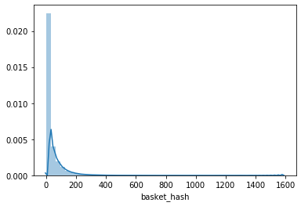
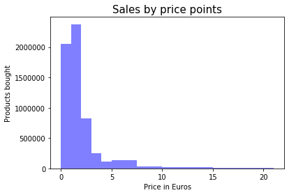
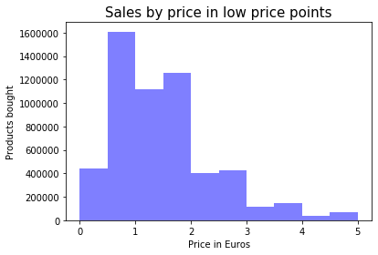
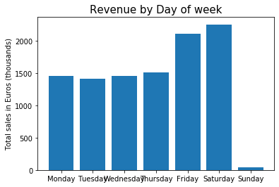
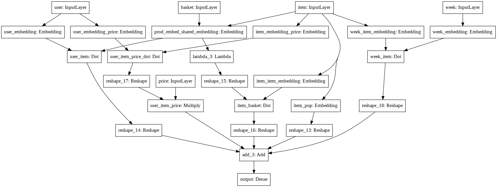
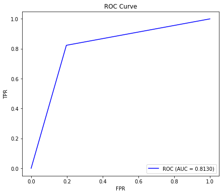

+++
title = "SHOPPER"
date = '2017-12-14'
tags = [ "Deep Learning", "Neural Networks", "Class17/18",]
categories = ["Course projects"]
banner = "img/seminar/sample/hu-logo.jpg"
author = "Class of Winter Term 2017 / 2018"
disqusShortname = "https-wisample-github-io-blog"
description = " Testy mctestface"
+++

# Introduction

It's no secret that consumers today are faced with a more product choices than ever before. While having many choices can be beneficial to a point, eventually it can become overwhelming and consumers can become paralysed in the face of so many options. For this reason, many online, and offline, businesses have created tools and methods to recommend certain products to certain groups of consumers, thereby reducing the number of products a consumer has to consider. Of course, recommendation is no easy task, and much has been written about the best method to use. 

Many recommendation algorithms focus on latent variables that seek to describe underlying user preferences and item attributes. Most, however, do not include external factors such as price or seasonality. From a retailer's perspective, it would be ideal to know the maximum price each customer is willing to pay for each item. Retailers could then potentially have personalized per-item prices for each consumer, which would maximize the retailer's revenue.

One way this could be achieved is if all products were unpurchasable by default, or simply more expensive than anyone’s willingness to pay (WTP), and all customers entering the store receive a voucher for all the products they came to buy, allowing them to purchase at the price that they are willing to pay. Though unrealistic, this example illustrates how one could achieve personalized pricing, as actively displaying different prices per customer in a store is unfeasible, and if possible, would lead to customer dissatisfaction.

In this blog, we will build an interpretable network to predict customer choice. We will estimate latent user preferences, seasonal effects and price sensitivities. The focus will be placed particularly on the grocery industry. Firstly we review the current state-of-the-art models used for personalized recommendation: Poisson factorization and Exponential family embeddings. Then we showcase a model combining and further extending the features of these two models, a sequential probabilistic model called SHOPPER. Finally, we proceed to build our own predictive model based on SHOPPER, through embeddings on customer, item, basket, seasonal and price levels.

## Status Quo in Marketing

### Poisson factorization

Widely used in E-commerce settings, hierarchical Poisson factorization captures user-to-item interaction, extracting user preferences for recommendation of previously unpurchased products through past purchases of other similar customers. The mathematics underlying this model are straightforward: users’ preferences are Gamma distributed based on their past activity (number of shopping trips) and items’ attributes are Gamma distributed based on their popularity (number of purchases). The user-item interaction is expressed in the rating (either a points scale, such as 1-5 stars, or binary dummy for purchase), which is Poisson distributed according to the user’s preference and item’s attribute. As a simple example, imagine a customer who has only bought vegetables in her five previous shopping trips (activity). This customer’s preference would thus be classified as vegetarian. On the other hand, the shop has a variety of frequently bought (popular) vegetables (which is an attribute of those items). As other customers with the preference “vegetarian” have bought asparagus, the resulting “rating” will be high, and thus this customer would receive a recommendation to buy asparagus. 
It is called hierarchical due to the ordering of both items and users; some products are bought more frequently than others (are more popular), and some customers execute more purchases than others (are more active). 


### Exponential Family Embeddings

Yet better than Poisson factorization is the collection of models called Exponential family embeddings. It stems from methods created for natural language processing, such as word embeddings, but can be extended to other highly-relational datasets. It is composed of individual terms (originally words, in our case grocery items) that make up a corpus (dictionary or store inventory) and are mutually bound in a context (sentence or a shopping basket) via conditional probability. This link is the probability that a specific item is in this particular basket given all the other items in the same basket, and comes from an exponential distribution, such as Poisson for discrete and Gaussian for real-valued data points. The objective is to maximize these conditional probabilities of the whole corpus, which creates shared embeddings for each term. Through these latent embeddings, we can calculate similarity (and dissimilarity) as the cosine distance between the embedding vectors and thus represent how similar items are to each other. Moreover, “Poisson embeddings can capture important econometric concepts, such as items that tend not to occur together but occur in the same contexts (substitutes) and items that co-occur, but never one without the other (complements)” [p.2, Rudolph et al 2016].


These state-of-the-art models have their shortcomings; neither of these capture price effects and seasonality patterns. This is where our star model, Shopper, jumps in, combining the item interaction of EFE and user preferences of HPF, but also extracts unobserved latent variables (whims), and additionally accounts for price effects and seasonality patterns.

# Shopper - What is it and how does it work?


The SHOPPER algorithm (*Blei et al.*) is a sequential probabilistic model for market baskets. The main idea of SHOPPER is to model how customers choose items in their basket when shopping for groceries, taking various factors into account, including seasonal effects, personal preferences, price sensitivities and cross item interactions. SHOPPER is a structered model, in that it assumes customers behave in a specific way. The strcuture comes form microeconomic theory and a maximazation of utilities(REF).

SHOPPER posits that a customer walks into the store and sequentially chooses each item to be placed in the basket. The customer chooses each item based on personal preferences, price, seasonality and overall item popularity. As each item is placed into the basket, the customer then takes the current products in the basket into account when deciding on the next product. One can imagine a typical shopping trip, where the customer goes in with an intent to buy a specific item, eg cheese, and later decides to spontaneously purchase complementary products, such as wine and crackers, to accompany the cheese. Although the customer initially had no intention of purchasing wine and crackers, the presence of cheese increased the attractiveness of the complementary products. SHOPPER generates latent variables to model these factors, estimates an overall utility value for each shopping trip and calculates a probability of observing a set of items in a given basket.

The basics of the model can be summarized with the following 5 equations:
 
1. $$\psi_{tc} = \lambda_{c} + \theta_{ut}^T \alpha_{c} - \gamma_{ut}^T \beta_{c} log(r_{tc}) + \delta_{wt}^T \mu_{c} $$

2. $$\Psi(c, y_{t, i-1}) = \psi_{tc} + \rho_{c}^T(\frac{1}{i-1} \displaystyle\sum_{j=1}^{i-1} \alpha_{y_{tj}} )$$

3. $$max \space U_{t,c}(y_{t, i-1}) = \Psi(c, y_{t, i-1}) + \epsilon_{t,c}  $$

4. $$p(y_{ti} = c | \mathbf{y}_{t, i-1}) = \frac{exp\{\Psi(c, \mathbf{y}_{t, i-1})\}}{\Sigma_{c' \notin y_{t, i-1}}exp\{\Psi(c', \mathbf{y}_{t, i-1})\} } $$

5. $$\widetilde{U}_t(\mathcal{Y_t}) = \displaystyle\sum_{c \in \mathcal{Y_t}} \psi_{tc} + \frac{1}{|\mathcal{Y_t}| - 1} \displaystyle\sum_{(c, c') \in \mathcal{Y_t} \times \mathcal{Y_t}:c'\neq c} v_{c',c}$$

Although daunting at first, the model can be broken down into smaller pieces to fully understand it. From a conceptual point of view SHOPPER posits that a consumer seeks to maximize the utility received from their basket each shopping trip (equation 5). They do this by selecting an item from all of the available items in the store (equation 4), and the product most likely to be chosen is the one that provides them with the highest utility (equation 3). The utility function can be described as a log-linear function with latent variables representing: item popularity, user preferences, price sensitivities, seasonal effects and cross item interactions (equations 1 and 2). The following sections will delve further into detail for each equation. 

## Equation 1 (Latent Variables)

$$\psi_{tc} = \lambda_{c} + \theta_{ut}^T \alpha_{c} - \gamma_{ut}^T \beta_{c} log(r_{tc}) + \delta_{wt}^T \mu_{c} $$

Equation 1 represents the utility a customer gets from item $c$ in trip $t$. The above equation can be divided into several smaller portions.

*Item Popularity* : $\lambda_{c}$ can be thought of as representing a latent (time invariant) intercept term that captures overall item popularity. In this case, the more popular an item is, the higher the value of this variable should be.

*User Preferences* : To get a more accurate utility estimate, SHOPPER creates a per-user latent vector $\theta_{u}$, along with a per-item latent $\alpha_c$. The inner product of the two vectors is then taken and added to the unnormalized log probability of each item. Unlike traditional multinomial logit models, that restrict themselves to a handful of items, or group items to a handful of categorys, using SHOPPER we can generate individual preferences per item for each user individually. A larger inner product indicates a higher preference a user has for a certain item. It is important to note that the per-user latent vector is estimated for each trip, but the per-item vector is held constant across all trips. This represents the fact that  users can have different utilities for an item depending on that individual trip, but the underlying characteristics of the product remain the same across time. An additional benefit to this is that we now also have per-user and per-item vectors that can be used in other tasks like clustering. 

*Price Sensitivities* : An important aspect in discrete choice modelling is the effect of price on choices. Let $r_{tc}$ represent the price of price of product $c$ at trip $t$. SHOPPER posits that each user has an individualized price elasticity to each item. $\gamma_{ut}$ represents a new set of per-user latent vectors that are different from $\theta_{u}$ and $\beta_{c}$ represents a new set of per-item latent vectors that are different from $\alpha_c$. $\gamma_{ut}^T \beta_{c}$ then represents the price elasticity for each user for each item. $\gamma_{ut}^T \beta_{c}$ is restricted to be positive, so that $- \gamma_{ut}^T \beta_{c} log(r_{tc})$ remains negative. This implies that an increase in the price of item $c$ will decrease the utility the customer recieves from item $c$, making it less likely the customer chooses item $c$ in trip $t$. This assumption is consistent with similar assumptions in other discrete choice models.

Instead of using the raw price SHOPPER uses the normalized prices, i.e., the price of item $c$ at trip $t$ is divided by the per-item mean price. This has the benefit of bringing $\beta_c$ to a comparable scale, so that items with comparatively larger prices can be compared fairly with items that have a comparatively smaller price. Another benefit is that normalizing the price ensures other latent variables return the average outcome. When the price term takes it's average value, the price term vanishes because $log(1) = 0$

*Seasonality* : When estimating other latent variables, the effect of seasonality must also be considered. It can be expected that certain items sell more depending on the time of year, e.g. chocolates at Easter, champagne at New Year's, candy at Halloween, etc, partly because demand increases, as well as sales implemented by the store. Neglecting seasonality can lead to estimating variables that do not isolate the effect of price. For example, champagne sells more at New Year's partly because of an increase in demand, but also because the store may put that product on sale to induce more sales. In order to prevent this seasonal effect from confounding the estimates of the other latent vectors, SHOPPER adds the per-week item interaction effect $\delta_{wt}^T \mu_{c}$, where $\delta_{w}$ represents the per-week latent vectors and $\mu_{c}$ represents a new set of per-item latent vactors. The inner product represents the seasonal effect on each product, i.e. products with a higher value in a given week add more to utility than products with a lower value and have a higher probabliity of being purchased. Including $\mu_{c}$ also allows for correlated seasonal effects accross items, i.e. two products that are purchased in the same season should have similar latent vectors. In this model, we could expect chocolate and eggs to have a higher inner product during easter than any other time in the year.


## Equation 2 (Item-Item Interactions)

$$\Psi(c, y_{t, i-1}) = \psi_{tc} + \rho_{c}^T(\frac{1}{i-1} \displaystyle\sum_{j=1}^{i-1} \alpha_{y_{tj}} )$$

Using equation 1 we can calculate the utility a customer receives from item $c$ in trip $t$, ignoring all other items in their basket. This can ignore important item to item interaction effects. For example, if a customer has already placed crackers in their basket, then the utility obtained by buying cheese would be greater than if the cheese was purchased without crackers. To model these item to item interactions, SHOPPER introduces the term $\rho_c$. 

If we consider two items $c$ and $c'$, then $\rho_c$ represents the interaction effects of product $c$ has with $c'$. Using the item attribute vector, $\alpha_{c'}$ estimated earlier in equation 1 we can estimate the complementary and substitution effects of different products. If $\rho_{c}^T \alpha_{c'}$ is large, then the presence of item $c'$ in the basket increases the benefit choosing item $c$. In the language of economics, we can say these two products are complements. Even though two items may have different underlying latent vectors, i.e. cheese and crackers, they may still be purchased together because they are complements. Conversely, when $\rho_{c}^T \alpha_{c'}$ is smaller, we can interpret these items as substitutes. Even if the latent item vectors are similar, the two products can still be substitutes, i.e. crackers and crispbread (Knäckebrot).

In the SHOPPER model, when the customer is deciding whether to put item $c$ in the basket, they do not consider the item to item interaction of every single item individually. Instead SHOPPER takes the average value of the latent item vectors of the products already in the basket and calculates the inner product with $\rho_{c}$. The scaling factor $ \frac{1}{(i - 1)}$ captures the idea that in larger baskets each individual item has a smaller effect on the addition of new product in the basket. 

Additionally, the utility function is additive in the other items in the basket, meaning SHOPPER assumes item interactions within the basket are linear. This is a point that could be studied for future work, to see if item interactions are linear or not.


## Equation 3 & 4 (Utility and Choice Probabilities)


From equation 1 and 2 we calculate the term $\Psi(c, y_{t, i-1})$, which is interpreted as the utility a customer receives from item $c$, given the week, price, and other items in the basket. The customer's problem then becomes:

$$max \space U_{t,c}(y_{t, i-1}) = \Psi(c, y_{t, i-1}) + \epsilon_{t,c} $$

Those familiar with discrete choice modelling will quickly recognize the above formula as a random utlity model. Upon entering the store, the customer is presented with a set of alternatives they must choose from. The customer chooses the alternative that maximizes their utility, i.e. if item $c$ generates a higher utility than item $c'$, the customer chooses item $c$. In this case $U(c) > U(c')$. The full utility $U$ is known to the customer, but is not fully observable by another person. There is some random component that is not observable by the researcher. In SHOPPER, $\Psi(c, y_{t, i-1})$ represents the deterministic portion of the customer's utility, the portion that can be modelled, and $\epsilon_{t,c}$ represents the random portion of utility. SHOPPER assumes $\epsilon_{t,c}$ has zero mean, is i.i.d and follows a Gumbel distribution. 

### Random Utility Model

Let $U_{tc}$ represent the utility a customer receives from choosing item c on trip $t$ and $C$ represent the full set of alternatives ($c = 1, 2, ... ,C$; with $C\geq2$) the customer can choose from. 

The customer then chooses item $c$ from the set of alternatives that provides the highest utilities. The customer chooses item c where $U_{tc} > U_{tc'} \; \forall \: c \neq c' $. Therefore the probability that the customer chooses a specific alternative can be written as $Prob(U_{tc} > U_{tc'} \; \forall \: c \neq c')$. Plugging in our utility function from before (equation 3) results in the following expression:

$P_c = p(\Psi(c, y_{t, i-1}) + \epsilon_{t,c} > \Psi(c', y_{t, i-1}) + \epsilon_{t,c'}, \; \forall \: c \neq c') $

Using the derivation from Train 2009 (Discrete Choice Methods WIth Simulation) and the assumption of i.i.d error terms  that follow a Gumbel distribution we can show that the probability of choosing item $c$ can be described using a softmax function.

$p(y_{ti} = c | \mathbf{y}_{t, i-1}) = \frac{exp\{\Psi(c, \mathbf{y}_{t, i-1})\}}{\Sigma_{c' \notin y_{t, i-1}}exp\{\Psi(c', \mathbf{y}_{t, i-1})\} } $

To calculate the probability item $c$ is chosen we exponentiate the customer's utility in trip $t$ with respect to item $c$ and divide that by the sum of all other utilites raised to base $e$. Keen observers will note that this is simply a softmax function over all possible items. This can be difficult to costly to calculate, so an alternate method is used instead (see Appendix)

## Equation 5 (Putting it All Together)

We have now seen the decision making process of our customer when choosing a single product, but the overall goal of the shopping trip is to maximize the utility of the entire basket. In this case, the shopper only cares about the items that are in their basket at the end of the trip and not necessarily in what order they were placed in.

$$\widetilde{U}_t(\mathcal{Y_t}) = \displaystyle\sum_{c \in \mathcal{Y_t}} \psi_{tc} + \frac{1}{|\mathcal{Y_t}| - 1} \displaystyle\sum_{(c, c') \in \mathcal{Y_t} \times \mathcal{Y_t}:c'\neq c} v_{c',c}$$

From the above equation, we see that the customer chooses items such that the unordered set of items $\mathcal{Y_t}$ maximizes utility. $\displaystyle\sum_{c \in \mathcal{Y_t}} \psi_{tc}$ represents the sum of the utilities earned from each item in the basket. $\frac{1}{|\mathcal{Y_t}| - 1} \displaystyle\sum_{(c, c') \in \mathcal{Y_t} \times \mathcal{Y_t}:c'\neq c} v_{c',c}$ represents the utility gained from item-item interactions in the basket. 

 


  

## Probabilities of Unordered Baskets

Equation 5 from above actually represents the utility a shopper gains from the unordered set of items in their basket, but using our softamx function from earlier, we can calculate the probability of an *ordered* basket. 

The probability of an ordered basket is simply the product of the individual choice probabilities. For example, the probability of getting the basket $(bread, eggs, milk)$ equals $p(bread) \times p(eggs) \times p(milk)$. In general, it can be written as:

$$p(\mathbf{y}_t | \rho, \alpha) = \displaystyle \prod_{i=1}^{n_t} p(y_{ti}| \mathbf{y}_{t, i-1}, \rho, \alpha) $$

where $n_t$ represents the last item in the basket for that trip. However, in most offline real-world datasets, the order in which items are added to the basket is not observed. To account for this, Shopper calculates the likelihood of an unordered set of items $\mathcal{Y}_t$, by summing over all the possible orderings. In our small example above, this corresponds to $$p(\{bread, eggs, milk\}) = p((bread, eggs, milk)) + p((eggs, bread, milk)) + p((eggs, milk, bread)) + ...$$

For only three items, we have to consider six different probabilities. As the basket size grows to $n$ items, we then have to sum over $n!$ probabilities, which can become slow to calculate very quickly. The probability of an unordered basket can be generalized as:

$$ p(\mathcal{Y}_t | \rho, \alpha) = \displaystyle \sum_{\pi}p(\mathbf{y}_{t, \pi}| \rho, \alpha) $$

where $\pi$ is a premutation of the items in the basket. SHOPPEr will generate its latent variables to maximize the log of this probability. The closer the log-likelihood is to zero, the better the latent variables describe the data. 


### How is SHOPPER different

As we have seen, SHOPPER combines techniques and knowledge from various domains to create a generative model that can estimate user preferences, seasonal factors, and price elasticities. SHOPPER imposes a structure on the model, noteably using the Random Utility Model as a model of customer behaviour. This model has been in frequent use in marketing since the 1970s. By applying a structure to the model, SHOPPER users are able to draw insights from the results and make counterfactual assumptions using the price elasticity estimates.

## Nitty Gritty


### Matrix Factorization

Now that we have seen how SHOPPER works conceptually, we can look into how the latent variables are actually generated. 

One option of creating latent variables is to simply create a one-hot encoded matrix. We could create a vector for each shopper that has a 1 for each item they have bought, and a zero for products they did not buy. If we repeat this process for all shoppers, we create our one hot encoded cusomer-item matrix. The rows of our matrix can actually be considered an embedding for that shopper, as we have now converted a shopper's purchases into a numerical vector. Similarly the columns of our matrix can be considered to be the item embedding, as we now see which shoppers purchased that item. The following shows an example of what a one-hot encoded matrix would look like:


<!-- Consider a world with 4 shoppers $(A, B, C, D)$ and 10 items $(a, b,..., j)$
$ 
 \begin{matrix}
  & a & b & c & d & e & f & g & h & i & j \\
A & 0 & 0 & 0 & 0 & 0 & 0 & 1 & 0 & 0 & 0 \\
B & 0 & 0 & 1 & 0 & 1 & 0 & 0 & 0 & 0 & 0 \\
C & 0 & 1 & 1 & 1 & 0 & 0 & 0 & 0 & 0 & 0 \\
D & 0 & 0 & 1 & 1 & 1 & 1 & 1 & 0 & 0 & 0 \\
E & 0 & 0 & 1 & 1 & 0 & 0 & 0 & 1 & 1 & 0 \\
 \end{matrix}
$ -->

We can see that it is easy to summarize across shoppers or products, but it is difficult to see any underlying patterns among users or products. A large number of shoppers and products can also cause memory problems very quickly, the dimensions of the matrix are $number \ of \ unique \ shoppers * number \ of \ unique \ items$. Much of the matrix is also sparse, meaning most entries are 0, because most shoppers do not purchase or even consider all of the unique products for sale. For our small example, this is not a problem but larger datasets with thousands of unique shoppers and thousands of unique products, require a higher memory capacity. 

To solve this problem we turn to MF. MF posits that there are a set of latent variables (unobservable variables) that describe each shopper and each item, such that when multiplied together the resulting product is our observed shopper-item matrix. In our small example, we believe that there are 5 latent variables that can accurately describe shoppers and items. Therefore we create two matrices $Shoppers$ and $Items$, that hold our shoppers' latent variables and items' latent variables, respectively. To begin with, we initialize the matrices randomly. They would look something like this, where $l_i$ represents latent variable $i$:


<!-- $$ Shoppers =  \begin{matrix}
  & l_1 & l_2 & l_3 & l_4 & l_5 \\
A & 0.1 & 0.55 & 0.32 & 0.78 & 0.67 \\
B & 0.7 & 0.67 & 0.11 & 0.4 & 0.56 \\
C & 0.23 & 0.34 & 0.01 & 0.2 & 0.43 \\
D & 0 & 0.99 & 0.22 & 0.06 & 0.32 \\
E & 0.44 & 0.32 & 0.47 & 0.01 & 0.48 \\
 \end{matrix}
 $$

 $$
Items = \begin{matrix}
  & a & b & \dots & j \\
l_1 & 0.11 & 0.22 &  & 0.96  \\
l_2 & 0.32 & 0.67 & \dots & 0.54 \\
l_3 & 0.52 & 0.55 &   & 0.67  \\
l_4 & 0.56 & 0.33 & \dots & 0.78 \\
l_5 & 0.78 & 0.75 &  & 0.54 \\
 \end{matrix}  $$ -->

The rows of our $Shoppers$ matrix represent latent shopper variables,and the columns of our $Items$ matrix represent latent item variables. We need to estimate our latent variables such that $Shoppers \cdot Items $ is equal to our observed shopper-item matrix.
To see if our factorization is going well, we define an error function. In traditional matrix factorization, an error ter such as the matrix norm or mean squared error is used to calculate the error. However, the authors of SHOPPER define a variational inference algorithm that optimizes the factorization based on the log-likliehood of baskets described earlier. The algorithm is out of the scope of this post, but interested readers can see it here.


## Our Task

We will now attempt to replicate the SHOPPER model using a neural network framework. The trick here is to turn SHOPPER, a generative model, into a discriminative model, one that optimizes by making a prediction. We will take a deeper look into the unique challenges of this problem and our corresponding results.

# Data Exploration and Preparation

Our dataset contains all purchases made in an unspecified grocery chain made between April 2015 and March 2017 in Germany. The information available to us is the user ID, shopping basket ID, product description, category and sub-category of the product, price and date of purchase. 
Our data is classified into 119 categories (e.g. Fruits) and 911 unique subcategories (e.g. Apples). 

### Read in data 

Here we seperate our file into chunks and drop rows that have no value for item description or user ID. Since we will be estimating individual preferences and item attributes, we require these two columns for the model. 


```
#import pandas library
import pandas as pd
pd.set_option('display.max_rows', 500)
from google.colab import drive
drive.mount('/content/drive')
import datetime

# read csv in chunks
df = pd.read_csv('baskets.gz', sep = '|', chunksize = 1000000)

# read in product information
products = pd.read_table('master_product.tsv.gz')

# identify products that have 'PFAND' in the article text and remove them
# also remove products that have a category name of 'other', ie products like shirts, irons, etc 
pfand_prods = products[products['article_text'].str.contains("PFAND")].rpid.to_list()
pfand_prods.extend(products[products['subcategory_name'].str.contains("Pfand")].rpid.to_list())
pfand_prods.extend(products[products['category_name'] == 'other'].rpid.to_list())
pfand_prods = list(set(pfand_prods))

# append each chunk df here 
chunk_list = []

# Each chunk is in df format
for chunk in df:
    # remove unnecessary columns
    del chunk['store_id'], chunk['till_id'], chunk['gtin']
    
    # Preliminary data cleaning
    chunk_filter = chunk.merge(products, how = 'left', left_on ='product_id', right_on = 'rpid')
    chunk_filter = chunk_filter[~chunk_filter['product_id'].isin(pfand_prods)] # remove Pfand and other category items 
    chunk_filter = chunk_filter.dropna(subset = ['article_text'], axis = 0, how = 'any') # remove NA's in article_text
    chunk_filter = chunk_filter.dropna(subset = ['user_id'], axis = 0, how = 'any') # remove rows with NA's in user_id
    
    # drop duplicate items in each basket, we only want to consider if the item was bought with other products or not,
    # not the number of products. In our data, 2 of the same products in a basket are entered as two seperate rows.
    chunk_filter = chunk_filter.drop_duplicates(subset = ['user_id', 'basket_hash', 'article_text'])

    # convert date to datetime
    chunk_filter['day'] = pd.to_datetime(chunk_filter['day'])
    
    # extract week
    chunk_filter['week'] = chunk_filter['day'].dt.week
    
    # extract year
    chunk_filter['year'] = chunk_filter['day'].dt.year
    
    # create bought column equal to 1 for prediction task later
    chunk_filter["bought"] = 1
    
    # calculate the number of products in each basket
    chunk_filter['prods_in_basket'] = chunk_filter.groupby('basket_hash')['article_text'].transform('count')
    
    # keep only the columns we need 
    chunk_filter = chunk_filter[['basket_hash', 'article_text', 'user_id', 'price', 'day', 'category_name', 'subcategory_name', 'prods_in_basket', 'week', 'year', 'bought']]
    
    # Once the data filtering is done, append the chunk to list
    chunk_list.append(chunk_filter)
    
# concat the list into dataframe 
df_concat = pd.concat(chunk_list)

```


```
df_concat.describe([0.02, 0.1, 0.25, 0.5, 0.75, 0.85, 0.9, 0.95, 0.98])
```


<div>
<style scoped>
    .dataframe tbody tr th:only-of-type {
        vertical-align: middle;
    }

    .dataframe tbody tr th {
        vertical-align: top;
    }

    .dataframe thead th {
        text-align: right;
    }
</style>
<table border="1" class="dataframe">
  <thead>
    <tr style="text-align: right;">
      <th></th>
      <th>basket_hash</th>
      <th>user_id</th>
      <th>price</th>
      <th>prods_in_basket</th>
    </tr>
  </thead>
  <tbody>
    <tr>
      <th>count</th>
      <td>1.205839e+08</td>
      <td>1.205839e+08</td>
      <td>1.205839e+08</td>
      <td>1.205839e+08</td>
    </tr>
    <tr>
      <th>mean</th>
      <td>6.689876e+14</td>
      <td>2.980680e+05</td>
      <td>1.760459e+00</td>
      <td>1.220974e+01</td>
    </tr>
    <tr>
      <th>std</th>
      <td>5.325177e+18</td>
      <td>3.287824e+05</td>
      <td>1.771819e+00</td>
      <td>9.472519e+00</td>
    </tr>
    <tr>
      <th>min</th>
      <td>-9.223371e+18</td>
      <td>1.000000e+00</td>
      <td>-2.495900e+02</td>
      <td>1.000000e+00</td>
    </tr>
    <tr>
      <th>2%</th>
      <td>-8.854942e+18</td>
      <td>6.487000e+03</td>
      <td>2.500000e-01</td>
      <td>2.000000e+00</td>
    </tr>
    <tr>
      <th>10%</th>
      <td>-7.377275e+18</td>
      <td>3.838300e+04</td>
      <td>5.500000e-01</td>
      <td>3.000000e+00</td>
    </tr>
    <tr>
      <th>25%</th>
      <td>-4.610714e+18</td>
      <td>1.209930e+05</td>
      <td>8.900000e-01</td>
      <td>6.000000e+00</td>
    </tr>
    <tr>
      <th>50%</th>
      <td>-4.416611e+14</td>
      <td>2.085390e+05</td>
      <td>1.390000e+00</td>
      <td>1.000000e+01</td>
    </tr>
    <tr>
      <th>75%</th>
      <td>4.612632e+18</td>
      <td>3.677930e+05</td>
      <td>1.990000e+00</td>
      <td>1.600000e+01</td>
    </tr>
    <tr>
      <th>85%</th>
      <td>6.458280e+18</td>
      <td>4.530980e+05</td>
      <td>2.690000e+00</td>
      <td>2.100000e+01</td>
    </tr>
    <tr>
      <th>90%</th>
      <td>7.379322e+18</td>
      <td>5.011380e+05</td>
      <td>2.990000e+00</td>
      <td>2.400000e+01</td>
    </tr>
    <tr>
      <th>95%</th>
      <td>8.302024e+18</td>
      <td>1.378196e+06</td>
      <td>4.200000e+00</td>
      <td>3.100000e+01</td>
    </tr>
    <tr>
      <th>98%</th>
      <td>8.854137e+18</td>
      <td>1.480803e+06</td>
      <td>5.990000e+00</td>
      <td>3.900000e+01</td>
    </tr>
    <tr>
      <th>max</th>
      <td>9.223371e+18</td>
      <td>1.835212e+06</td>
      <td>9.999900e+02</td>
      <td>1.610000e+02</td>
    </tr>
  </tbody>
</table>
</div>


## Data exploration

### Number of products in a basket

To get a sense of our shoppers' habits, we first take a look at the distribution of the number of items in each basket. This will also become important later for our modelling.


```
import seaborn as sns
import matplotlib.pyplot as plt

sns.set(color_codes=True)

# histogram of number of products in baskets
sns.distplot(df_concat['prods_in_basket'])

# mean baskets = 12
# median baskets = 10
```


    <matplotlib.axes._subplots.AxesSubplot at 0x7f521b209a90>


We have a large variance in the number of products in each basket, but in order to be able to get the item to item embeddings, we consider baskets that only have more than 2 products in the basket. Also, we do not want baskets that have too many products, as the basket value would overwhelm any of our other embeddings. For this reason we limit the basket size to maximum of 40 products. 


```
#filter out baskets with less than two products and more than 40
df_concat = df_concat[(df_concat['prods_in_basket'] >= 2) & (df_concat['prods_in_basket'] <= 40)]
```

In addition to the number of items in a basket, we also consider the number of times a shopper has visited the store. It does not make sense to estimate user preferences when we have such a small number of visits for that user. We would only be adding noise to the model, so we consider dropping infrequent visitors.


```
#count number of baskets by user ID
no_baskets_by_user = df_concat.groupby('user_id')['basket_hash'].nunique()

print(no_baskets_by_user.describe([0.02, 0.1, 0.25, 0.5, 0.75, 0.85, 0.9, 0.95, 0.98]))
sns.distplot(no_baskets_by_user)
```

    count    561110.000000
    mean         33.023765
    std          57.186352
    min           1.000000
    2%            1.000000
    10%           1.000000
    25%           1.000000
    50%          10.000000
    75%          40.000000
    85%          69.000000
    90%          94.000000
    95%         141.000000
    98%         211.000000
    max        1584.000000
    Name: basket_hash, dtype: float64
    


    <matplotlib.axes._subplots.AxesSubplot at 0x7f00536c86a0>





We have many users that have only visted the store once in our dataset. It is impossible for us to train and test on users that we don't have enough data for, so we will only consider users that have visted the store more than 10 times.


```
no_baskets_by_user = no_baskets_by_user[no_baskets_by_user >= 10]

```

In addition to limiting ourselves to shoppers with more than 10 visits, we also consider a sample of shopper IDs. Our total dataset includes about 25 000 unique shoppers, and in the interest of focusing on modelling and experimenting quickly, we consider a subsample of them. Throughout the project we considered sampling 5000, 10 000, and 15 000 shoppers. The goal being to show that our model can generate latent variables for tens of thousands of shoppers. Going forward, we will consider a sample of 15 000 unique shopping IDs.


```
import numpy as np

# take a random sample of 15000 user IDs
user_sample = np.random.choice(no_baskets_by_user.sort_values(ascending=False).index, 15000)

# filter our df so only user IDs from our sample are in df
df_filter = df_concat[df_concat['user_id'].isin(user_sample)]

# select necessary columns
total_filter = df_filter[['basket_hash', 'article_text', 'user_id', 'price', 'day', 'category_name', 'subcategory_name', 'week', 'year', 'bought']]
```

After filtering out products with only one item or more than 40 items in the basket, there were 12 items in a basket on average. We now have a dataframe with 15000 unique users, and only necessary columns. Now we extract the week and year from the day column so that we can join our prices table, and use the week column for our week embeddings.


```
total_filter.head()
```


<div>
<style scoped>
    .dataframe tbody tr th:only-of-type {
        vertical-align: middle;
    }

    .dataframe tbody tr th {
        vertical-align: top;
    }

    .dataframe thead th {
        text-align: right;
    }
</style>
<table border="1" class="dataframe">
  <thead>
    <tr style="text-align: right;">
      <th></th>
      <th>basket_hash</th>
      <th>article_text</th>
      <th>user_id</th>
      <th>price</th>
      <th>day</th>
      <th>category_name</th>
      <th>subcategory_name</th>
      <th>week</th>
      <th>bought</th>
    </tr>
  </thead>
  <tbody>
    <tr>
      <th>0</th>
      <td>-5739786015782748519</td>
      <td>Frischli H-MILCH 1,5% FETT 1L</td>
      <td>5758.0</td>
      <td>0.55</td>
      <td>2015-04-23</td>
      <td>milk</td>
      <td>H-Milch</td>
      <td>17</td>
      <td>1</td>
    </tr>
    <tr>
      <th>1</th>
      <td>-5739786015782748519</td>
      <td>AMERICAN CLUB FILTERHUELSEN 200ER</td>
      <td>5758.0</td>
      <td>0.99</td>
      <td>2015-04-23</td>
      <td>tobacco</td>
      <td>Sonstiger Rauchbedarf, z. B. Zigarettenp</td>
      <td>17</td>
      <td>1</td>
    </tr>
    <tr>
      <th>2</th>
      <td>-5739786015782748519</td>
      <td>JEDEN TAG BABY FEUCHTTÜCHER SENSITIV DUO-PACK ...</td>
      <td>5758.0</td>
      <td>1.99</td>
      <td>2015-04-23</td>
      <td>baby_body_care</td>
      <td>Pflegetücher für die Säuglings- und Kind</td>
      <td>17</td>
      <td>1</td>
    </tr>
    <tr>
      <th>3</th>
      <td>-5739786015782748519</td>
      <td>JUETRO BROCCOLI  750G TIEFGEFROREN</td>
      <td>5758.0</td>
      <td>1.99</td>
      <td>2015-04-23</td>
      <td>frozen_vegetables</td>
      <td>Speisekohl</td>
      <td>17</td>
      <td>1</td>
    </tr>
    <tr>
      <th>4</th>
      <td>-5739786015782748519</td>
      <td>PALL MALL ALLROUND FULL FLAVOUR 99G</td>
      <td>5758.0</td>
      <td>15.50</td>
      <td>2015-04-23</td>
      <td>tobacco</td>
      <td>Feinschnitt-Tabak</td>
      <td>17</td>
      <td>1</td>
    </tr>
  </tbody>
</table>
</div>


### Item View


```
# check item sales by day
total_filter['month'] = total_filter['day'].dt.month
total_filter['dayofweek'] = total_filter['day'].dt.strftime('%a').astype(CategoricalDtype(categories = ['Mon','Tue','Wed','Thu','Fri','Sat','Sun'], ordered=True))
```


```
total_filter.describe(include=['object'])
```


<div>
<style scoped>
    .dataframe tbody tr th:only-of-type {
        vertical-align: middle;
    }

    .dataframe tbody tr th {
        vertical-align: top;
    }

    .dataframe thead th {
        text-align: right;
    }
</style>
<table border="1" class="dataframe">
  <thead>
    <tr style="text-align: right;">
      <th></th>
      <th>article_text</th>
      <th>day</th>
      <th>category_name</th>
      <th>subcategory_name</th>
    </tr>
  </thead>
  <tbody>
    <tr>
      <th>count</th>
      <td>5882684</td>
      <td>5882684</td>
      <td>5882684</td>
      <td>5882684</td>
    </tr>
    <tr>
      <th>unique</th>
      <td>28298</td>
      <td>686</td>
      <td>110</td>
      <td>911</td>
    </tr>
    <tr>
      <th>top</th>
      <td>PRESSERZEUGN.7% MWST</td>
      <td>2015-10-02</td>
      <td>vegetables</td>
      <td>Joghurt, H-Joghurt, Joghurtzubereitungen</td>
    </tr>
    <tr>
      <th>freq</th>
      <td>77613</td>
      <td>22524</td>
      <td>479195</td>
      <td>176391</td>
    </tr>
  </tbody>
</table>
</div>


#### Bestsellers

The top ten bestselling items in the dataset are the following: 

1. Pfand (Bottle deposit)
2. Newspapers
3. Bananas
4. Bread rolls
5. Shopping bags
6. Pickles
7. Tomatoes
8. Butter
9. Whole milk
10. Potatoes


```
# check highest selling items
df_top_items = total_filter.groupby(['article_text'])['article_text'].agg(
    {"purchases": len}).sort_values(
    "purchases", ascending=False).head(20).reset_index()

df_top_items
```

    /usr/local/lib/python3.6/dist-packages/ipykernel_launcher.py:2: FutureWarning: using a dict on a Series for aggregation
    is deprecated and will be removed in a future version. Use                 named aggregation instead.
    
        >>> grouper.agg(name_1=func_1, name_2=func_2)
    
      
    


<div>
<style scoped>
    .dataframe tbody tr th:only-of-type {
        vertical-align: middle;
    }

    .dataframe tbody tr th {
        vertical-align: top;
    }

    .dataframe thead th {
        text-align: right;
    }
</style>
<table border="1" class="dataframe">
  <thead>
    <tr style="text-align: right;">
      <th></th>
      <th>article_text</th>
      <th>purchases</th>
    </tr>
  </thead>
  <tbody>
    <tr>
      <th>0</th>
      <td>PRESSERZEUGN.7% MWST</td>
      <td>77613</td>
    </tr>
    <tr>
      <th>1</th>
      <td>Bananen Cavendish KG</td>
      <td>57026</td>
    </tr>
    <tr>
      <th>2</th>
      <td>A&amp;P Schrippe Discount-Konzept 60g, Prebake</td>
      <td>37711</td>
    </tr>
    <tr>
      <th>3</th>
      <td>Schlaufentraget. Kaisers Im green</td>
      <td>36252</td>
    </tr>
    <tr>
      <th>4</th>
      <td>Sinustragetasche Kaiser`s Im green</td>
      <td>34873</td>
    </tr>
    <tr>
      <th>5</th>
      <td>Gurken 350g-400g - NL</td>
      <td>30864</td>
    </tr>
    <tr>
      <th>6</th>
      <td>Bio Bananen KG</td>
      <td>26237</td>
    </tr>
    <tr>
      <th>7</th>
      <td>Tomaten Rispen  KG</td>
      <td>24261</td>
    </tr>
    <tr>
      <th>8</th>
      <td>Deutsche Markenbutter Gold mildges. 250g</td>
      <td>24193</td>
    </tr>
    <tr>
      <th>9</th>
      <td>Tomaten Cocktailstrauch 300g Schale</td>
      <td>20284</td>
    </tr>
    <tr>
      <th>10</th>
      <td>Frischgold Vollmilch 3,5% 1 Ltr. ESL</td>
      <td>18905</td>
    </tr>
    <tr>
      <th>11</th>
      <td>Speisekartoffeln KG v.f.k.</td>
      <td>18764</td>
    </tr>
    <tr>
      <th>12</th>
      <td>Frischgold Milch 1,5% 1Ltr.  ESL</td>
      <td>18659</td>
    </tr>
    <tr>
      <th>13</th>
      <td>"Äpfel Braeburn KG /"mild säuerlich/" "</td>
      <td>18637</td>
    </tr>
    <tr>
      <th>14</th>
      <td>Speisemoehren / Karotten  KG gelegt</td>
      <td>18399</td>
    </tr>
    <tr>
      <th>15</th>
      <td>Frischli H-MILCH 1,5% FETT 1L</td>
      <td>17024</td>
    </tr>
    <tr>
      <th>16</th>
      <td>NATURKIND Bio Eier 6er</td>
      <td>16291</td>
    </tr>
    <tr>
      <th>17</th>
      <td>EIER AUS BODEN-       HALTUNG KL.M 10ER</td>
      <td>16173</td>
    </tr>
    <tr>
      <th>18</th>
      <td>Paprika Rot  KG</td>
      <td>15162</td>
    </tr>
    <tr>
      <th>19</th>
      <td>Schrippe (BS)  ca. 60g, Discount Konzept</td>
      <td>14300</td>
    </tr>
  </tbody>
</table>
</div>


```
# because shopping bags are one of the most frequently purchased products and they do not hold any prediction value, we exclude them from our model
total_filter = total_filter.drop(total_filter[total_filter.subcategory_name == "Tragetaschen"].index)
```

#### Price Points

We can observe that most products are selling at low price points - most of the store's revenue comes from products cheaper than 5 Euros, and in fact, most products cost between 50 cents and 1 Euro. This fact is specific to grocery stores.


```
n, bins, patches = plt.hist(df['price'], bins=[0,1,2,3,4,5,7.5,10,15,21], facecolor='blue', alpha=0.5)
plt.title("Sales by price points", fontsize=15)
plt.xlabel("Price in Euros")
plt.ylabel("Products bought")
plt.show()

# most sales comes from products <2 Euros
```





```
n, bins, patches = plt.hist(df['price'], bins=[0,0.5,1,1.5,2,2.5,3,3.5,4,4.5,5], facecolor='blue', alpha=0.5)
plt.title("Sales by price in low price points", fontsize=15)
plt.xlabel("Price in Euros")
plt.ylabel("Products bought")
plt.show()
```





#### Seasonality

Some days are more popular for shopping than others. If you prefer to do your groceries in peace and quiet, consider going on Tuesday; if however you enjoy the rush and crowds, Saturday is your (and everyone else's) day to visit. Note that in Germany, stores are closed on Sundays! 

There is not as much variation when it comes to months. Still, the most revenue is usually made in April, when Germans stack up on their favourite asparagus, while in October people rather go trick-or-treating than grocery shopping. 

Although there is little difference in the number of products sold between individual months, *which* products are sold differs immensely. The product sub-categories with the greatest degree of seasonality entail, unsurprisingly, Easter marzipan, Christmas chocolate figures, figs and other dried fruit, stem vegetables (including asparagus), venison, poultry and nuts.


```
plt.bar(df_by_weekday['dayofweek'],df_by_weekday['revenue']/1000)
plt.ylabel('Total sales in Euros (thousands)')
plt.title('Revenue by Day of week', fontsize=15)
plt.show()

# remove revenue info
```





```
df_by_month = total_filter[total_filter['year']==2016].groupby('month').agg(
    {'basket_hash': pd.Series.nunique, #number of baskets
    'user_id': pd.Series.nunique, #customers
    'article_text': pd.Series.count, #items bought
    'price': np.sum #revenue
    }
)

df_by_month.rename(columns={'basket_hash':'shopping_trips',
                          'user_id':'unique_customers',
                          'article_text':'items_bought',
                          'price':'revenue'}, 
                 inplace=True)
df_by_month['unique_customers'] = df_by_month['unique_customers'].astype(int)
df_by_month['revenue'] = df_by_month['revenue'].round(2)
df_by_month
```


<div>
<style scoped>
    .dataframe tbody tr th:only-of-type {
        vertical-align: middle;
    }

    .dataframe tbody tr th {
        vertical-align: top;
    }

    .dataframe thead th {
        text-align: right;
    }
</style>
<table border="1" class="dataframe">
  <thead>
    <tr style="text-align: right;">
      <th></th>
      <th>shopping_trips</th>
      <th>unique_customers</th>
      <th>items_bought</th>
      <th>revenue</th>
      <th>month</th>
    </tr>
    <tr>
      <th>month</th>
      <th></th>
      <th></th>
      <th></th>
      <th></th>
      <th></th>
    </tr>
  </thead>
  <tbody>
    <tr>
      <th>1</th>
      <td>45401</td>
      <td>9134</td>
      <td>301713</td>
      <td>508834.75</td>
      <td>1</td>
    </tr>
    <tr>
      <th>2</th>
      <td>45108</td>
      <td>9163</td>
      <td>289596</td>
      <td>499493.49</td>
      <td>2</td>
    </tr>
    <tr>
      <th>3</th>
      <td>43167</td>
      <td>8990</td>
      <td>280099</td>
      <td>497737.85</td>
      <td>3</td>
    </tr>
    <tr>
      <th>4</th>
      <td>44900</td>
      <td>8937</td>
      <td>291258</td>
      <td>515948.13</td>
      <td>4</td>
    </tr>
    <tr>
      <th>5</th>
      <td>41562</td>
      <td>8708</td>
      <td>269960</td>
      <td>486341.13</td>
      <td>5</td>
    </tr>
    <tr>
      <th>6</th>
      <td>42821</td>
      <td>8592</td>
      <td>273018</td>
      <td>480978.99</td>
      <td>6</td>
    </tr>
    <tr>
      <th>7</th>
      <td>41606</td>
      <td>8468</td>
      <td>267830</td>
      <td>471895.04</td>
      <td>7</td>
    </tr>
    <tr>
      <th>8</th>
      <td>39848</td>
      <td>8083</td>
      <td>252980</td>
      <td>433307.37</td>
      <td>8</td>
    </tr>
    <tr>
      <th>9</th>
      <td>39378</td>
      <td>8053</td>
      <td>254060</td>
      <td>435413.03</td>
      <td>9</td>
    </tr>
    <tr>
      <th>10</th>
      <td>36095</td>
      <td>7814</td>
      <td>242590</td>
      <td>422013.15</td>
      <td>10</td>
    </tr>
    <tr>
      <th>11</th>
      <td>36403</td>
      <td>7687</td>
      <td>242495</td>
      <td>426875.51</td>
      <td>11</td>
    </tr>
    <tr>
      <th>12</th>
      <td>36017</td>
      <td>7491</td>
      <td>248327</td>
      <td>467408.78</td>
      <td>12</td>
    </tr>
  </tbody>
</table>
</div>


```
plt.bar(df_by_month['month'],df_by_month['revenue']/1000)
plt.ylabel('Monthly sales in Euros (thousands)')
plt.title('Revenue per Month', fontsize=15)
plt.show()
# Most frequent month: March
# Least frequent month: October
# in 2016 only
```


```
# Which types of products (sub-categories) have most variation in sales between different months?

df_subcat_by_month = total_filter.groupby(['subcategory_name','month'])['article_text'].transform('count')
df_subcat_by_month.rename(columns={'article_text':'items_bought'}, inplace=True)
df_subcat_by_month_range = pd.DataFrame( ((df_subcat_by_month['items_bought'].max(level=0) - df_subcat_by_month['items_bought'].min(level=0)) / df_subcat_by_month['items_bought'].mean(level=0) ), )
df_subcat_by_month2 = df_subcat_by_month_range.sort_values(by='items_bought',ascending=False).reset_index()
df_subcat_by_month2.rename(columns={'items_bought':'relative_change_between_months'},inplace=True)
df_subcat_by_month2.head(20)
# relative_change_between_months = 4 means that the difference between the best-selling and worst-selling month for the category is 4 times higher than the mean sales
```


<div>
<style scoped>
    .dataframe tbody tr th:only-of-type {
        vertical-align: middle;
    }

    .dataframe tbody tr th {
        vertical-align: top;
    }

    .dataframe thead th {
        text-align: right;
    }
</style>
<table border="1" class="dataframe">
  <thead>
    <tr style="text-align: right;">
      <th></th>
      <th>subcategory_name</th>
      <th>relative_change_between_months</th>
    </tr>
  </thead>
  <tbody>
    <tr>
      <th>0</th>
      <td>Oster-Marzipan</td>
      <td>9.312500</td>
    </tr>
    <tr>
      <th>1</th>
      <td>Weihnachtshohlfiguren, -schokolade, -gel</td>
      <td>7.566879</td>
    </tr>
    <tr>
      <th>2</th>
      <td>Feigen</td>
      <td>5.931148</td>
    </tr>
    <tr>
      <th>3</th>
      <td>Speisekohl, Blatt- und Stängelgemüse</td>
      <td>5.786458</td>
    </tr>
    <tr>
      <th>4</th>
      <td>Kanditen und Belegfrüchte, z. B. solche</td>
      <td>4.962963</td>
    </tr>
    <tr>
      <th>5</th>
      <td>Wildfleisch, roh (ohne Wildgeflügel)</td>
      <td>4.938776</td>
    </tr>
    <tr>
      <th>6</th>
      <td>Sonstige Brühwürstchen</td>
      <td>4.928571</td>
    </tr>
    <tr>
      <th>7</th>
      <td>Wildgeflügel</td>
      <td>4.918033</td>
    </tr>
    <tr>
      <th>8</th>
      <td>Oster-Hohlfiguren, -pralinen, -gelee, -f</td>
      <td>4.855491</td>
    </tr>
    <tr>
      <th>9</th>
      <td>Hasel-, Para-, Pekan- und Walnüsse, Nuss</td>
      <td>4.639405</td>
    </tr>
    <tr>
      <th>10</th>
      <td>Spargel</td>
      <td>4.539398</td>
    </tr>
    <tr>
      <th>11</th>
      <td>Enten</td>
      <td>4.486842</td>
    </tr>
    <tr>
      <th>12</th>
      <td>Erd- und Paranusskerne, Cashewkerne</td>
      <td>4.281407</td>
    </tr>
    <tr>
      <th>13</th>
      <td>Weizenmischbrot ganz BD</td>
      <td>4.260870</td>
    </tr>
    <tr>
      <th>14</th>
      <td>Sonstige Saisonartikel aus Schokolade, M</td>
      <td>4.002848</td>
    </tr>
    <tr>
      <th>15</th>
      <td>Gänse</td>
      <td>4.000000</td>
    </tr>
    <tr>
      <th>16</th>
      <td>Wildgeflügel Selbstbedienung</td>
      <td>3.836066</td>
    </tr>
    <tr>
      <th>17</th>
      <td>Spezialbrot ganz BD</td>
      <td>3.826087</td>
    </tr>
    <tr>
      <th>18</th>
      <td>Obst- und Gemüsesäfte</td>
      <td>3.750000</td>
    </tr>
    <tr>
      <th>19</th>
      <td>Suppen, trocken oder pastös (einschl. In</td>
      <td>3.693694</td>
    </tr>
  </tbody>
</table>
</div>


## Data preparation

As we have seen, the bestselling products include the “Pfand” (the deposit for bottles and cans) and shopping bags. These do not have much value for our predictive model, as in most cases the prices for these are set by law and hence coupons are not applicable, therefore we remove these two product subcategories. 
Apart from the specific products, we have made a few assumptions about general shopping trends. Firstly, assuming that good personal recommendations can be made only for loyal customers, we have restricted our dataset to customers who have visited the store at least 10 times. Secondly, to be able to utilize the features of other products in the basket, we allow only baskets with at least two items, and at most 40 items to avoid outliers. Thirdly, we predict only which items the customer is going to consider, no matter the quantity, therefore we disregard all duplicate entries (originally, if a customer bought three bananas, we would have three identical rows in our dataset). 


Since we are turning a generative model into one that makes predictions, we need to make adjustments to our dateset. SHOPPER fits the latent variables it generates to the shopping baskets data and minimizes the log likelihood. However, in order for our model to work we must give it a prediction task on which to optimize. 

One problem that occurs when facing such a task is that in a dataset with actual shopping data, there will be only products that were bought by customers and not products that were considered but not bought. However, when building a model that is designed to predict what product a customer is considering to buy it should also train on products that were not bought, to correctly generate the preferences of a shopper.

A solution for this problem is to add products that are not bought into the data so that the model sees both, products that were bought and products that were not bought. Such a process needs some assumptions and factor in specifics of shopping in order to sample new products into the data.

The "most correct" way for us to model shopper choices would be for us to treat the problem as a discrete choice problem. We would have to calculate the probability that a specific item was chosen by the shopper over all available products. This would essentially become a softmax function over 35 000 items in our case. Since this is not technically feasible, we use a trick inspired by word2vec.

Instead of considering one item against all other items, we instead sample items that the shopper did not place in their basket, assign them a "bought" value of 0, and predict whether or not the shopper bought the item. The problem then becomes a binary choice problem, "bought" or "not bought", over bought items and our sampled not-bought items. This speeds up our calculations and should also generate robust results, as seen in other applications (source). 

For our sampling procedure, we make the following assumptions:

1.   A shopper considers products from the same subcategories as the items in his/her basket. For example, if the customer buys spaghetti he also considered penne or maybe spaghetti from a different brand on the shelf.
2.   The price of the product that was not bought will be equal to the most frequent price the particular product was bought at in the respective week and year

These assumptions lead to a certain expectation about the shopping habits of customers. We assume that if a shopper has bought a product, then he must have at least seen other products from the same sub-category and chosen not to purchase them. This assumption leaves room for optimisation, as it is debatable if the customer only considers one other product for every product he bought. In general, customers most likely consider more than one item when shopping, however then the model would rely on even more generated data which we wanted to prevent. The suitability number of not-bought product sampled can be discussed and for further research needs to be addressed again, nevertheless we move forward.


Below we describe our sampling procedure for not-bought items:
 
1.   Group all products by subcategory name, year, and week.
2.   Group shopper purchases into baskets, by grouping on user id and       basket hash. 
3.   Randomly sample an item from the full group that is in the same
     subcategory as the item in the shopper's basket, and not already
     in the shopping basket.
4.   Fill in the rows of the new products with data of the remaining
     columns from the original product except for price.
5.   Calculate the most frequent price at which a particular product
     was sold in a particular week and year. For prices that are        unavailable we use the previous week's price, and if still unavailable, we use the following week's price.
6.   Mark sampled products as not bought, by assigning a bought value of 0.


We first create groups for all products which were available in a subcategory for each week and year combination. We will use these groups to sample unbought products into the dataset which we are using for our model.


```
# Step 1
# create groups of products by subcategory, week and year
groups = df_concat.groupby(['year','week','subcategory_name']).apply(lambda x: x['article_text'].unique())
groups.head()
```


    year  week  subcategory_name                        
    2015  16    Ausländische Qualitätsschaumweine (Sekt)           [prosecco frizz. doc bella aura oro 0.75l]
                Bananen                                                                [bananen cavendish kg]
                Bierschinken Selbstbedienung                                              [bierschinken 200g]
                Blatt- und Stängelgemüse (ohne Salate)                    [iglo port.blattspinat 500g tiefge]
                Brötchen BD                                 [meisterstück / meisterschrippe (bs), a&p schr...
    dtype: object


Next we group the products a user bought in one shopping trip into a basket, which contains all the products he bought in this trip.


```
# Step 2
# create baskets for each user containing the products of a particular shopping trip
baskets = total_filter.groupby(['user_id','basket_hash']).apply(lambda x: x['article_text'].unique())
baskets
```


    user_id    basket_hash         
    442.0      -8717244567711960099    [haribo konfekt  lakritz  200g, waldquelle cla...
               -8706933430938556035    [lorenz erdnuss locken jumbos 225g, rufin fein...
               -8685103104264859614    [bio zentrale ahornsirup 250ml, frischgold mil...
               -8680938939970530513                 [burger knäckebrot delikatesse 250g]
               -8584861831361893801    [frischgold milch 1.5% 1ltr.  esl, schrippe (b...
                                                             ...                        
    1821754.0   6460538675951702206    [schrippe /  spitzbrötchen premium (bs)  ca 75...
                7798499040000251981    [speiskartoffeln 2.5 kg m.k. sorte: siehe etik...
                7919008002285420495             [bauernbrötchen nach mailänder art (bs)]
                8712853537921653904    [blutorangen sanguinelli 1kg netz, geramont cr...
                8766703745985938372    [baerenmarke milch 1.8% fett 1 liter, mandarin...
    Length: 305890, dtype: object


We then take the difference between the group of all products and the basket of products of a certain shopping trip. From this difference, we randomly select one product from the same subcategory as a product that was bought. Thereby creating a new product which was not bought by this customer in his shopping trip.


```
# Step 3
# randomly taking a product from the same subcategory as a product that was bought 

import random
new_rows = pd.Series([random.choice(list(set(groups[(x.year, x.week, x.subcategory_name)]).difference(set(baskets[(x.user_id, x.basket_hash)])))) for x in total_filter.itertuples() if len(list(set(groups[(x.year, x.week, x.subcategory_name)]).difference(set(baskets[(x.user_id, x.basket_hash)])))) > 0])
new_rows
```


    0                   baerenmarke haltb.    alpenmilch 1.5% 1l
    1                      zwaar blister papier  4x50 blaettchen
    2                                 bobini feuchtetuecher 20+4
    3                        juetro rahm blum.kohl 300g tiefgefr
    4                                      apollo zig.tabak 200g
                                     ...                        
    1152177                                 m&m¿s peanut ei 250g
    1152178                           lindt goldhase weiss  100g
    1152179               grünländer scheiben gartenkräuter 150g
    1152180    gala nr. 1 fein gemahlen 500g vaku  (alte beze...
    1152181                café royal lungo forte 10 kapseln=55g
    Length: 1152182, dtype: object


Next we fill the rows of the new product with data of the remaining columns from the original bought item except for price.


```
# Step 4
# fill the rows of the new products with data of the remaining columns 
# from the original product except for price
new_sample = pd.DataFrame({'basket_hash': [x.basket_hash for x in total_filter.itertuples() if len(list(set(groups[(x.year, x.week, x.subcategory_name)]).difference(set(baskets[(x.user_id, x.basket_hash)])))) > 0],
                           'article_text': new_rows,                                      
                           'user_id': [x.user_id for x in total_filter.itertuples() if len(list(set(groups[(x.year, x.week, x.subcategory_name)]).difference(set(baskets[(x.user_id, x.basket_hash)])))) > 0],
                           'week': [x.week for x in total_filter.itertuples() if len(list(set(groups[(x.year, x.week, x.subcategory_name)]).difference(set(baskets[(x.user_id, x.basket_hash)])))) > 0],
                           'year': [x.year for x in total_filter.itertuples() if len(list(set(groups[(x.year, x.week, x.subcategory_name)]).difference(set(baskets[(x.user_id, x.basket_hash)])))) > 0],
                           'category_name': [x.category_name for x in total_filter.itertuples() if len(list(set(groups[(x.year, x.week, x.subcategory_name)]).difference(set(baskets[(x.user_id, x.basket_hash)])))) > 0],                           
                           'subcategory_name': [x.subcategory_name for x in total_filter.itertuples() if len(list(set(groups[(x.year, x.week, x.subcategory_name)]).difference(set(baskets[(x.user_id, x.basket_hash)])))) > 0]})

new_sample
```


<div>
<style scoped>
    .dataframe tbody tr th:only-of-type {
        vertical-align: middle;
    }

    .dataframe tbody tr th {
        vertical-align: top;
    }

    .dataframe thead th {
        text-align: right;
    }
</style>
<table border="1" class="dataframe">
  <thead>
    <tr style="text-align: right;">
      <th></th>
      <th>basket_hash</th>
      <th>article_text</th>
      <th>user_id</th>
      <th>week</th>
      <th>year</th>
      <th>category_name</th>
      <th>subcategory_name</th>
    </tr>
  </thead>
  <tbody>
    <tr>
      <th>0</th>
      <td>-5739786015782748519</td>
      <td>baerenmarke haltb.    alpenmilch 1.5% 1l</td>
      <td>5758.0</td>
      <td>17</td>
      <td>2015</td>
      <td>milk</td>
      <td>H-Milch</td>
    </tr>
    <tr>
      <th>1</th>
      <td>-5739786015782748519</td>
      <td>zwaar blister papier  4x50 blaettchen</td>
      <td>5758.0</td>
      <td>17</td>
      <td>2015</td>
      <td>tobacco</td>
      <td>Sonstiger Rauchbedarf, z. B. Zigarettenp</td>
    </tr>
    <tr>
      <th>2</th>
      <td>-5739786015782748519</td>
      <td>bobini feuchtetuecher 20+4</td>
      <td>5758.0</td>
      <td>17</td>
      <td>2015</td>
      <td>baby_body_care</td>
      <td>Pflegetücher für die Säuglings- und Kind</td>
    </tr>
    <tr>
      <th>3</th>
      <td>-5739786015782748519</td>
      <td>juetro rahm blum.kohl 300g tiefgefr</td>
      <td>5758.0</td>
      <td>17</td>
      <td>2015</td>
      <td>frozen_vegetables</td>
      <td>Speisekohl</td>
    </tr>
    <tr>
      <th>4</th>
      <td>-5739786015782748519</td>
      <td>apollo zig.tabak 200g</td>
      <td>5758.0</td>
      <td>17</td>
      <td>2015</td>
      <td>tobacco</td>
      <td>Feinschnitt-Tabak</td>
    </tr>
    <tr>
      <th>...</th>
      <td>...</td>
      <td>...</td>
      <td>...</td>
      <td>...</td>
      <td>...</td>
      <td>...</td>
      <td>...</td>
    </tr>
    <tr>
      <th>1152177</th>
      <td>-6536134241320279174</td>
      <td>m&amp;m¿s peanut ei 250g</td>
      <td>122212.0</td>
      <td>12</td>
      <td>2017</td>
      <td>seasonal_sweets</td>
      <td>Oster-Marzipan</td>
    </tr>
    <tr>
      <th>1152178</th>
      <td>-6536134241320279174</td>
      <td>lindt goldhase weiss  100g</td>
      <td>122212.0</td>
      <td>12</td>
      <td>2017</td>
      <td>seasonal_sweets</td>
      <td>Oster-Marzipan</td>
    </tr>
    <tr>
      <th>1152179</th>
      <td>-6536134241320279174</td>
      <td>grünländer scheiben gartenkräuter 150g</td>
      <td>122212.0</td>
      <td>12</td>
      <td>2017</td>
      <td>cheese</td>
      <td>Hart-,Schnitt-&amp;halbfester Schnittkäse SB</td>
    </tr>
    <tr>
      <th>1152180</th>
      <td>-6536134241320279174</td>
      <td>gala nr. 1 fein gemahlen 500g vaku  (alte beze...</td>
      <td>122212.0</td>
      <td>12</td>
      <td>2017</td>
      <td>coffee</td>
      <td>Röstkaffee, koffeinhaltig, gemahlen</td>
    </tr>
    <tr>
      <th>1152181</th>
      <td>-6536134241320279174</td>
      <td>café royal lungo forte 10 kapseln=55g</td>
      <td>122212.0</td>
      <td>12</td>
      <td>2017</td>
      <td>coffee</td>
      <td>Röstkaffee, koffeinhaltig, gemahlen</td>
    </tr>
  </tbody>
</table>
<p>1152182 rows × 7 columns</p>
</div>


The only value that is still missing is the price of the product. In our data there are lots of different prices for the same products, depending on season, coupons or other outside factors. Similar to the groups of products we create a list where we can find the most frequent price at which a particular product was sold in a respective week and year. As there can still be a week where we do not have a price for a certain product we use forward and backward fill. Therefore we will always get a price for our new products.

There can be instances where prices are higher or lower depending on the day in a certain week. In the data there are sometimes differences in price even on the same day. However, this sampling approach generates reliable data that can be seen as the majority price of a certain product at which the customer did not buy the product.

Imputing the prices was a necessary step for us, since we did not have a full list of product prices to simply look up from. We only had the prices for sold products. However, grocery stores should have a price list fo rall products available, so this step would not be necessary and could be skipped.


```
df_prices = df_concat[['article_text', 'price', 'day']]
df_prices['day'] = pd.to_datetime(df_prices['day'])
df_prices['week'] = df_prices['day'].dt.week
df_prices['year'] = df_prices['day'].dt.year
```


```
def top_value_count(x):
    return x.value_counts().idxmax()
```


```
# Step 5
# calculate the most frequent price at which a particular product 
# was sold in a respective week and year
prices_top_freq = df_prices.groupby(['year','week', 'article_text'])['price']
prices = prices_top_freq.apply(top_value_count).reset_index()
```


```
prices
```


<div>
<style scoped>
    .dataframe tbody tr th:only-of-type {
        vertical-align: middle;
    }

    .dataframe tbody tr th {
        vertical-align: top;
    }

    .dataframe thead th {
        text-align: right;
    }
</style>
<table border="1" class="dataframe">
  <thead>
    <tr style="text-align: right;">
      <th></th>
      <th>year</th>
      <th>week</th>
      <th>article_text</th>
      <th>price</th>
    </tr>
  </thead>
  <tbody>
    <tr>
      <th>0</th>
      <td>2015</td>
      <td>16</td>
      <td>"äpfel braeburn kg /"mild säuerlich/" "</td>
      <td>1.50</td>
    </tr>
    <tr>
      <th>1</th>
      <td>2015</td>
      <td>16</td>
      <td>"äpfel jonagored 4er schale /"aromatisch süss/" "</td>
      <td>0.79</td>
    </tr>
    <tr>
      <th>2</th>
      <td>2015</td>
      <td>16</td>
      <td>1688 steinofenbrot 250g</td>
      <td>1.19</td>
    </tr>
    <tr>
      <th>3</th>
      <td>2015</td>
      <td>16</td>
      <td>6er ostereier aus bodenhaltung regenb. kl. m</td>
      <td>1.49</td>
    </tr>
    <tr>
      <th>4</th>
      <td>2015</td>
      <td>16</td>
      <td>a&amp;p bauernbrötchen mit roggen  discount-konzept</td>
      <td>0.50</td>
    </tr>
    <tr>
      <th>...</th>
      <td>...</td>
      <td>...</td>
      <td>...</td>
      <td>...</td>
    </tr>
    <tr>
      <th>624860</th>
      <td>2017</td>
      <td>13</td>
      <td>werder tomaten ketchup zuckerfrei 450ml</td>
      <td>1.59</td>
    </tr>
    <tr>
      <th>624861</th>
      <td>2017</td>
      <td>13</td>
      <td>whiskas junior kalb&amp;  gefluegel 100g sc</td>
      <td>0.55</td>
    </tr>
    <tr>
      <th>624862</th>
      <td>2017</td>
      <td>13</td>
      <td>xox knabberkrusten    50g  umstellung ld-sd  z...</td>
      <td>0.99</td>
    </tr>
    <tr>
      <th>624863</th>
      <td>2017</td>
      <td>13</td>
      <td>zewa ultra soft 4 lg 6x150 bl</td>
      <td>0.00</td>
    </tr>
    <tr>
      <th>624864</th>
      <td>2017</td>
      <td>13</td>
      <td>äpfel elstar kg</td>
      <td>1.86</td>
    </tr>
  </tbody>
</table>
<p>624865 rows × 4 columns</p>
</div>


```
# Step 6
# add the prices for our new products by merging with the most frequent prices 
new_sample2 = pd.merge(new_sample, prices, how = 'left', on = ['year', 'week', 'article_text'])

new_sample2['price'] = new_sample2.groupby('article_text')['price'].transform(lambda x: x.fillna(method = 'ffill'))
new_sample2['price'] = new_sample2.groupby('article_text')['price'].transform(lambda x: x.fillna(method = 'bfill'))

new_sample2
```


<div>
<style scoped>
    .dataframe tbody tr th:only-of-type {
        vertical-align: middle;
    }

    .dataframe tbody tr th {
        vertical-align: top;
    }

    .dataframe thead th {
        text-align: right;
    }
</style>
<table border="1" class="dataframe">
  <thead>
    <tr style="text-align: right;">
      <th></th>
      <th>basket_hash</th>
      <th>article_text</th>
      <th>user_id</th>
      <th>week</th>
      <th>year</th>
      <th>category_name</th>
      <th>subcategory_name</th>
      <th>price</th>
    </tr>
  </thead>
  <tbody>
    <tr>
      <th>0</th>
      <td>-5739786015782748519</td>
      <td>baerenmarke haltb.    alpenmilch 1.5% 1l</td>
      <td>5758.0</td>
      <td>17</td>
      <td>2015</td>
      <td>milk</td>
      <td>H-Milch</td>
      <td>1.19</td>
    </tr>
    <tr>
      <th>1</th>
      <td>-5739786015782748519</td>
      <td>zwaar blister papier  4x50 blaettchen</td>
      <td>5758.0</td>
      <td>17</td>
      <td>2015</td>
      <td>tobacco</td>
      <td>Sonstiger Rauchbedarf, z. B. Zigarettenp</td>
      <td>0.89</td>
    </tr>
    <tr>
      <th>2</th>
      <td>-5739786015782748519</td>
      <td>bobini feuchtetuecher 20+4</td>
      <td>5758.0</td>
      <td>17</td>
      <td>2015</td>
      <td>baby_body_care</td>
      <td>Pflegetücher für die Säuglings- und Kind</td>
      <td>0.99</td>
    </tr>
    <tr>
      <th>3</th>
      <td>-5739786015782748519</td>
      <td>juetro rahm blum.kohl 300g tiefgefr</td>
      <td>5758.0</td>
      <td>17</td>
      <td>2015</td>
      <td>frozen_vegetables</td>
      <td>Speisekohl</td>
      <td>0.99</td>
    </tr>
    <tr>
      <th>4</th>
      <td>-5739786015782748519</td>
      <td>apollo zig.tabak 200g</td>
      <td>5758.0</td>
      <td>17</td>
      <td>2015</td>
      <td>tobacco</td>
      <td>Feinschnitt-Tabak</td>
      <td>21.95</td>
    </tr>
    <tr>
      <th>...</th>
      <td>...</td>
      <td>...</td>
      <td>...</td>
      <td>...</td>
      <td>...</td>
      <td>...</td>
      <td>...</td>
      <td>...</td>
    </tr>
    <tr>
      <th>1152177</th>
      <td>-6536134241320279174</td>
      <td>m&amp;m¿s peanut ei 250g</td>
      <td>122212.0</td>
      <td>12</td>
      <td>2017</td>
      <td>seasonal_sweets</td>
      <td>Oster-Marzipan</td>
      <td>5.49</td>
    </tr>
    <tr>
      <th>1152178</th>
      <td>-6536134241320279174</td>
      <td>lindt goldhase weiss  100g</td>
      <td>122212.0</td>
      <td>12</td>
      <td>2017</td>
      <td>seasonal_sweets</td>
      <td>Oster-Marzipan</td>
      <td>2.99</td>
    </tr>
    <tr>
      <th>1152179</th>
      <td>-6536134241320279174</td>
      <td>grünländer scheiben gartenkräuter 150g</td>
      <td>122212.0</td>
      <td>12</td>
      <td>2017</td>
      <td>cheese</td>
      <td>Hart-,Schnitt-&amp;halbfester Schnittkäse SB</td>
      <td>1.49</td>
    </tr>
    <tr>
      <th>1152180</th>
      <td>-6536134241320279174</td>
      <td>gala nr. 1 fein gemahlen 500g vaku  (alte beze...</td>
      <td>122212.0</td>
      <td>12</td>
      <td>2017</td>
      <td>coffee</td>
      <td>Röstkaffee, koffeinhaltig, gemahlen</td>
      <td>5.49</td>
    </tr>
    <tr>
      <th>1152181</th>
      <td>-6536134241320279174</td>
      <td>café royal lungo forte 10 kapseln=55g</td>
      <td>122212.0</td>
      <td>12</td>
      <td>2017</td>
      <td>coffee</td>
      <td>Röstkaffee, koffeinhaltig, gemahlen</td>
      <td>2.89</td>
    </tr>
  </tbody>
</table>
<p>1152182 rows × 8 columns</p>
</div>


These sampled product now just have to be marked that they are not bought items in comparison to the original items that were bought and then put together with the original data to create our new dataset.


```
# products are sampled to add to data and were not bought
new_sample2['bought'] = 0
```


```
new_sample2 = new_sample2[['basket_hash', 'article_text', 'user_id', 'price', 'category_name','subcategory_name', 'bought', 'week', 'year']]
```


```
new_sample2
```


<div>
<style scoped>
    .dataframe tbody tr th:only-of-type {
        vertical-align: middle;
    }

    .dataframe tbody tr th {
        vertical-align: top;
    }

    .dataframe thead th {
        text-align: right;
    }
</style>
<table border="1" class="dataframe">
  <thead>
    <tr style="text-align: right;">
      <th></th>
      <th>basket_hash</th>
      <th>article_text</th>
      <th>user_id</th>
      <th>price</th>
      <th>category_name</th>
      <th>subcategory_name</th>
      <th>bought</th>
      <th>week</th>
      <th>year</th>
    </tr>
  </thead>
  <tbody>
    <tr>
      <th>0</th>
      <td>-5739786015782748519</td>
      <td>baerenmarke haltb.    alpenmilch 1.5% 1l</td>
      <td>5758.0</td>
      <td>1.19</td>
      <td>milk</td>
      <td>H-Milch</td>
      <td>0</td>
      <td>17</td>
      <td>2015</td>
    </tr>
    <tr>
      <th>1</th>
      <td>-5739786015782748519</td>
      <td>zwaar blister papier  4x50 blaettchen</td>
      <td>5758.0</td>
      <td>0.89</td>
      <td>tobacco</td>
      <td>Sonstiger Rauchbedarf, z. B. Zigarettenp</td>
      <td>0</td>
      <td>17</td>
      <td>2015</td>
    </tr>
    <tr>
      <th>2</th>
      <td>-5739786015782748519</td>
      <td>bobini feuchtetuecher 20+4</td>
      <td>5758.0</td>
      <td>0.99</td>
      <td>baby_body_care</td>
      <td>Pflegetücher für die Säuglings- und Kind</td>
      <td>0</td>
      <td>17</td>
      <td>2015</td>
    </tr>
    <tr>
      <th>3</th>
      <td>-5739786015782748519</td>
      <td>juetro rahm blum.kohl 300g tiefgefr</td>
      <td>5758.0</td>
      <td>0.99</td>
      <td>frozen_vegetables</td>
      <td>Speisekohl</td>
      <td>0</td>
      <td>17</td>
      <td>2015</td>
    </tr>
    <tr>
      <th>4</th>
      <td>-5739786015782748519</td>
      <td>apollo zig.tabak 200g</td>
      <td>5758.0</td>
      <td>21.95</td>
      <td>tobacco</td>
      <td>Feinschnitt-Tabak</td>
      <td>0</td>
      <td>17</td>
      <td>2015</td>
    </tr>
    <tr>
      <th>...</th>
      <td>...</td>
      <td>...</td>
      <td>...</td>
      <td>...</td>
      <td>...</td>
      <td>...</td>
      <td>...</td>
      <td>...</td>
      <td>...</td>
    </tr>
    <tr>
      <th>1152177</th>
      <td>-6536134241320279174</td>
      <td>m&amp;m¿s peanut ei 250g</td>
      <td>122212.0</td>
      <td>5.49</td>
      <td>seasonal_sweets</td>
      <td>Oster-Marzipan</td>
      <td>0</td>
      <td>12</td>
      <td>2017</td>
    </tr>
    <tr>
      <th>1152178</th>
      <td>-6536134241320279174</td>
      <td>lindt goldhase weiss  100g</td>
      <td>122212.0</td>
      <td>2.99</td>
      <td>seasonal_sweets</td>
      <td>Oster-Marzipan</td>
      <td>0</td>
      <td>12</td>
      <td>2017</td>
    </tr>
    <tr>
      <th>1152179</th>
      <td>-6536134241320279174</td>
      <td>grünländer scheiben gartenkräuter 150g</td>
      <td>122212.0</td>
      <td>1.49</td>
      <td>cheese</td>
      <td>Hart-,Schnitt-&amp;halbfester Schnittkäse SB</td>
      <td>0</td>
      <td>12</td>
      <td>2017</td>
    </tr>
    <tr>
      <th>1152180</th>
      <td>-6536134241320279174</td>
      <td>gala nr. 1 fein gemahlen 500g vaku  (alte beze...</td>
      <td>122212.0</td>
      <td>5.49</td>
      <td>coffee</td>
      <td>Röstkaffee, koffeinhaltig, gemahlen</td>
      <td>0</td>
      <td>12</td>
      <td>2017</td>
    </tr>
    <tr>
      <th>1152181</th>
      <td>-6536134241320279174</td>
      <td>café royal lungo forte 10 kapseln=55g</td>
      <td>122212.0</td>
      <td>2.89</td>
      <td>coffee</td>
      <td>Röstkaffee, koffeinhaltig, gemahlen</td>
      <td>0</td>
      <td>12</td>
      <td>2017</td>
    </tr>
  </tbody>
</table>
<p>1152182 rows × 9 columns</p>
</div>


We then concatenate the sampled not-bought products and bought products into one dataframe, reseting the index so that they are distributed within the bought products and are not appended in one big chunk e.g at the end.


```
# putting bought and sampled not bought products into one dataframe
final_df = total_filter.append(new_sample2).sort_index().reset_index(drop=True)
```

    /usr/local/lib/python3.6/dist-packages/pandas/core/frame.py:7138: FutureWarning: Sorting because non-concatenation axis is not aligned. A future version
    of pandas will change to not sort by default.
    
    To accept the future behavior, pass 'sort=False'.
    
    To retain the current behavior and silence the warning, pass 'sort=True'.
    
      sort=sort,
    


```
final_df
```


<div>
<style scoped>
    .dataframe tbody tr th:only-of-type {
        vertical-align: middle;
    }

    .dataframe tbody tr th {
        vertical-align: top;
    }

    .dataframe thead th {
        text-align: right;
    }
</style>
<table border="1" class="dataframe">
  <thead>
    <tr style="text-align: right;">
      <th></th>
      <th>article_text</th>
      <th>basket_hash</th>
      <th>bought</th>
      <th>category_name</th>
      <th>price</th>
      <th>subcategory_name</th>
      <th>user_id</th>
      <th>week</th>
      <th>year</th>
    </tr>
  </thead>
  <tbody>
    <tr>
      <th>0</th>
      <td>frischli h-milch 1.5% fett 1l</td>
      <td>-5739786015782748519</td>
      <td>1</td>
      <td>milk</td>
      <td>0.55</td>
      <td>H-Milch</td>
      <td>5758.0</td>
      <td>17</td>
      <td>2015</td>
    </tr>
    <tr>
      <th>1</th>
      <td>baerenmarke haltb.    alpenmilch 1.5% 1l</td>
      <td>-5739786015782748519</td>
      <td>0</td>
      <td>milk</td>
      <td>1.19</td>
      <td>H-Milch</td>
      <td>5758.0</td>
      <td>17</td>
      <td>2015</td>
    </tr>
    <tr>
      <th>2</th>
      <td>american club filterhuelsen 200er</td>
      <td>-5739786015782748519</td>
      <td>1</td>
      <td>tobacco</td>
      <td>0.99</td>
      <td>Sonstiger Rauchbedarf, z. B. Zigarettenp</td>
      <td>5758.0</td>
      <td>17</td>
      <td>2015</td>
    </tr>
    <tr>
      <th>3</th>
      <td>zwaar blister papier  4x50 blaettchen</td>
      <td>-5739786015782748519</td>
      <td>0</td>
      <td>tobacco</td>
      <td>0.89</td>
      <td>Sonstiger Rauchbedarf, z. B. Zigarettenp</td>
      <td>5758.0</td>
      <td>17</td>
      <td>2015</td>
    </tr>
    <tr>
      <th>4</th>
      <td>jeden tag baby feuchttücher sensitiv duo-pack ...</td>
      <td>-5739786015782748519</td>
      <td>1</td>
      <td>baby_body_care</td>
      <td>1.99</td>
      <td>Pflegetücher für die Säuglings- und Kind</td>
      <td>5758.0</td>
      <td>17</td>
      <td>2015</td>
    </tr>
    <tr>
      <th>...</th>
      <td>...</td>
      <td>...</td>
      <td>...</td>
      <td>...</td>
      <td>...</td>
      <td>...</td>
      <td>...</td>
      <td>...</td>
      <td>...</td>
    </tr>
    <tr>
      <th>2315704</th>
      <td>lindt doppelmilch osterfreunde 100g</td>
      <td>-6536134241320279174</td>
      <td>1</td>
      <td>seasonal_sweets</td>
      <td>3.79</td>
      <td>Oster-Marzipan</td>
      <td>122212.0</td>
      <td>12</td>
      <td>2017</td>
    </tr>
    <tr>
      <th>2315705</th>
      <td>lindt goldhasen in tasche  100g oster freuden</td>
      <td>-6536134241320279174</td>
      <td>1</td>
      <td>seasonal_sweets</td>
      <td>4.99</td>
      <td>Oster-Marzipan</td>
      <td>122212.0</td>
      <td>12</td>
      <td>2017</td>
    </tr>
    <tr>
      <th>2315706</th>
      <td>arla esrom scheiben   45% fett i.tr.175g</td>
      <td>-6536134241320279174</td>
      <td>1</td>
      <td>cheese</td>
      <td>1.89</td>
      <td>Hart-,Schnitt-&amp;halbfester Schnittkäse SB</td>
      <td>122212.0</td>
      <td>12</td>
      <td>2017</td>
    </tr>
    <tr>
      <th>2315707</th>
      <td>nescafe dolce gusto cappuccino 8er=200 g</td>
      <td>-6536134241320279174</td>
      <td>1</td>
      <td>coffee</td>
      <td>4.79</td>
      <td>Röstkaffee, koffeinhaltig, gemahlen</td>
      <td>122212.0</td>
      <td>12</td>
      <td>2017</td>
    </tr>
    <tr>
      <th>2315708</th>
      <td>nescafe dolce gusto cappuccino 8er=200 g</td>
      <td>-6536134241320279174</td>
      <td>1</td>
      <td>coffee</td>
      <td>4.79</td>
      <td>Röstkaffee, koffeinhaltig, gemahlen</td>
      <td>122212.0</td>
      <td>12</td>
      <td>2017</td>
    </tr>
  </tbody>
</table>
<p>2315709 rows × 9 columns</p>
</div>


Now that we have our bought and not bought products, we need to add one additional column. We are also estimating item-item interactions so we include an additional column that includes a list of all the other items that were purchased in by the shopper for that specific trip.


```
# step 7 add other items from basket into seperate column as a list
final_df['other_basket_prods'] = pd.Series([list(set(baskets[(x.user_id, x.basket_hash)]).difference(x.article_text)) for x in final_df.itertuples() ])

```

Currently, we are assuming that the shopper's basket is full and the item we are predicting on is their final, or "checkout" item. We do this because we do not observe the order in which the customer placed items into his basket. In a perfect world, we would have the order items were placed into the basket available to us and we could then iteratively fill the basket. This would give us a better estimation of item-item interactions. Now let's look at modelling.

# Model

As seen in SHOPPER our approach is to build a model for personalized shopping recommendations. The difference compared to SHOPPER is that we want to translate the whole process they are doing in SHOPPER into the tensorflow structure and see if that can yield the desired results as well. 
In order to be as close as possible to the original approach we looked at every part they were doing and translated it step-by-step into our model architecture. Most of the maths behind the shopper paper can be found in our approach as well. This can be seen for example with the way the embeddings are calculated. 
In the model architecture we will pick that thought up again and see what formula from shopper goes where in our model architecture.


For this attempt we are taking different inputs from the data and then creating embeddings for these inputs. The embeddings can be seen as latent vector representations, and the dot product of two of these embeddings then gives us the combination contribution to the overall utility. The dot product as well as some more embeddings and the price multiplication then add up to the function of the utility and is put through a sigmoid function in the last dense layer where we receive our probabilities of purchase.

In the model we have these five inputs from our data: user, basket, item, week and price. In the following we will go through the steps that we computed for creating the embeddings, moving on to the dot products and in the end adding it all up into the whole model. 

The formula from shopper that we want to use for our neural network is the equation 1 and 2 with latent variables and item-item interactions:

$$\psi_{tc} = \lambda_{c} + \theta_{ut}^T \alpha_{c} - \gamma_{ut}^T \beta_{c} log(r_{tc}) + \delta_{wt}^T \mu_{c} $$

$$\Psi(c, y_{t, i-1}) = \psi_{tc} + \rho_{c}^T(\frac{1}{i-1} \displaystyle\sum_{j=1}^{i-1} \alpha_{y_{tj}} )$$

Similar to what we described in the beginning, when we explained the different parts of this formula we will refresh the meaning of the different steps and then show how they are implemented into our model step by step.
The second equation above represents the utility a customer gets from item $c$ in trip $t$, which is what we want to have for our model, because it allows us to predict the probablilty at which a customer will by a certain product. The higher this utility is for an item $c$ the higher the chance the customer will buy it. These utilities change depending on the items in his basket.


## Model architecture

Prior to modelling, we must label encode all of our categorical variables, in order to use them as inputs into our embedding layers.


```
# creating label encoders for items, users and weeks
from sklearn.preprocessing import LabelEncoder

le = LabelEncoder()
le.fit(final_df['article_text'])
final_df['encoded_prods'] = le.transform(final_df['article_text'])
final_df['other_basket_prods_encoded'] = final_df['other_basket_prods'].apply(lambda x : le.transform(x))

le_user = LabelEncoder()
le_user.fit(final_df['user_id'])
final_df['encoded_user'] = le_user.transform(final_df['user_id'])

le_week = LabelEncoder()
le_week.fit(final_df['week'])
final_df['encoded_week'] = le_week.transform(final_df['week'])
```

We split our data into 80% training and 20% test sets. We elected to use a random split for this problem, as it is testing all possible seasons and holidays, rather than taking only the last few months of our dataset.


```
# splitting the data into train and test
from sklearn import model_selection

X = final_df.drop(["bought", 'basket_hash', 'category_name', 'subcategory_name'], axis = 1)
Y = final_df["bought"]

X_train, X_test, Y_train, Y_test = model_selection.train_test_split(
    X, Y, test_size = 0.2, random_state = 42)
```

Here we bring all of our basket sizes to equal length. Recall, that we limited the maximum size of our baskets to 40 products.


```

from keras.preprocessing.sequence import pad_sequences

largest_basket = X_train['other_basket_prods_encoded'].apply(lambda x: len(x)).max()
basket_prods_train_pad = pad_sequences(X_train['other_basket_prods_encoded'], maxlen = largest_basket + 1, padding = 'post')
basket_prods_test_pad = pad_sequences(X_test['other_basket_prods_encoded'], maxlen = largest_basket + 1, padding = 'post')

basket_prods_train_pad
```

    Using TensorFlow backend.
    


<p style="color: red;">
The default version of TensorFlow in Colab will soon switch to TensorFlow 2.x.<br>
We recommend you <a href="https://www.tensorflow.org/guide/migrate" target="_blank">upgrade</a> now 
or ensure your notebook will continue to use TensorFlow 1.x via the <code>%tensorflow_version 1.x</code> magic:
<a href="https://colab.research.google.com/notebooks/tensorflow_version.ipynb" target="_blank">more info</a>.</p>


    array([[10304, 11712, 30407, ...,     0,     0,     0],
           [ 1377, 32514,  2211, ...,     0,     0,     0],
           [ 2629,   298, 17131, ...,     0,     0,     0],
           ...,
           [ 3840, 23236,  2821, ...,     0,     0,     0],
           [20997, 30855, 35530, ...,     0,     0,     0],
           [ 4165,  3975,  7243, ...,     0,     0,     0]], dtype=int32)


```
import keras
from keras.layers import Input, Embedding, Dot, Reshape, Dense, concatenate, multiply, average, add, Average, Dropout
from keras.models import Model
from keras.optimizers import Adam

```

    Using TensorFlow backend.
    


<p style="color: red;">
The default version of TensorFlow in Colab will soon switch to TensorFlow 2.x.<br>
We recommend you <a href="https://www.tensorflow.org/guide/migrate" target="_blank">upgrade</a> now 
or ensure your notebook will continue to use TensorFlow 1.x via the <code>%tensorflow_version 1.x</code> magic:
<a href="https://colab.research.google.com/notebooks/tensorflow_version.ipynb" target="_blank">more info</a>.</p>


Here we define our input variables. We will have five inputs: the shopper ID, the item, the price of the item, the week in which the shopping trip took place, and the other items in the basket. All inputs have a shape of 1, aside from the basket input. This is because baskets can be of varying length, so we leave the dimensions as None, in order to be able to accomodate this.


```
# defining the inputs for our model user, item, price and week
embedding_size = 100 
user_len = len(le_user.classes_) + 1
item_len = len(le.classes_) + 1
week_len = len(le_week.classes_) + 1

user = Input(name = 'user', shape = (1,))
item = Input(name = 'item', shape = (1,))
price = Input(name = 'price', shape = (1,))
week = Input(name = 'week', shape = (1,))
basket = Input(name = 'basket', shape = (None,))
```

    WARNING:tensorflow:From /usr/local/lib/python3.6/dist-packages/keras/backend/tensorflow_backend.py:541: The name tf.placeholder is deprecated. Please use tf.compat.v1.placeholder instead.
    
    

The *Item Popularity*,  $\lambda_{c}$, captures the overall item popularity and will be represented in our model by the item popularity embedding that goes straight into our last add function. It has an embedding dimension of 1.


```
# creating the first embedding layer for item popularity with embedding size of 1
item_pop = Embedding(name = 'item_pop', 
                           input_dim = item_len, 
                           output_dim = 1)(item)

# Reshape to be a single number (shape will be (None, 1))
item_pop = Reshape(target_shape = (1, ))(item_pop)
```

    WARNING:tensorflow:From /usr/local/lib/python3.6/dist-packages/keras/backend/tensorflow_backend.py:4432: The name tf.random_uniform is deprecated. Please use tf.random.uniform instead.
    
    WARNING:tensorflow:From /usr/local/lib/python3.6/dist-packages/keras/backend/tensorflow_backend.py:66: The name tf.get_default_graph is deprecated. Please use tf.compat.v1.get_default_graph instead.
    
    

Next we implement the *User Preferences*, $\theta_{ut}^T \alpha_{c}$, as the dot product of the newly created user embedding $\theta_{u}$ and the item embedding $\alpha_c$. We create a shared embedding layer here that will be used for both indiviual items and the embeddings of items in our baskets variable. This is to ensure that the latent representation of an individual item and the latent representation of that same item in a basket remains the same. 


```
# creating the embeddings for user and item 
# Embedding the user (shape will be (None, 1, embedding_size))
user_embedding = Embedding(name = 'user_embedding',
                               input_dim = user_len,
                               output_dim = embedding_size)(user)

# shared item embedding layer for items and baskets
# use mask_zero = True, since we had to pad our baskets with zeros
prod_embed_shared = Embedding(name = 'prod_embed_shared_embedding', 
                           input_dim = item_len, 
                           output_dim = embedding_size,
                           input_length = None,
                           mask_zero =True)

# Embedding the product (shape will be (None, 1, embedding_size))
item_embedding = prod_embed_shared(item)

# Merge the layers with a dot product along the second axis 
# (shape will be (None, 1, 1))
user_item = Dot(name = 'user_item', axes = 2)([item_embedding, user_embedding])

# Reshape to be a single number (shape will be (None, 1))
user_item = Reshape(target_shape = (1, ))(user_item)
```

Jumping forward a bit, we consider the term $\rho_{c}^T(\frac{1}{i-1} \displaystyle\sum_{j=1}^{i-1} \alpha_{y_{tj}} )$ from equation 2. We first create a new item-item interaction vector $\rho_{c}$ that captures complementary effects between items. This is multiplied by the term $\displaystyle\sum_{j=1}^{i-1} \alpha_{y_{tj}}$, which is nothing more than the average of the vectors of all the other items in the shopping basket. Note that this $\alpha$ is the same as the $\alpha$ from our previous embedding. This is why we use a shared embedding layer.


```
# create item to item embedding
item_item_embedding = Embedding(name = 'item_item_embedding', 
                           input_dim = item_len, 
                           output_dim = embedding_size)(item)

# embed each item in a basket
basket_embedding = prod_embed_shared(basket)

# take the average of all item embeddings in a basket
avg_basket_embedding = keras.layers.Lambda(lambda x: keras.backend.mean(x, axis=1))(basket_embedding)
avg_basket_embedding = Reshape(target_shape=(1,embedding_size))(avg_basket_embedding)

# take the dot product of the item and the other items in the basket
# (shape will be (None, 1, 1))
item_basket = Dot(name = 'item_basket', axes = 2)([item_item_embedding, avg_basket_embedding])

# Reshape to be a single number (shape will be (None, 1))
item_basket = Reshape(target_shape = (1,))(item_basket)
```

We now consider estimating price sensitivities. From the SHOPPER algorithm we have, $\gamma_{ut}^T \beta_{c} log(r_{tc})$. We create new item and user embeddings $\gamma_{ut}$ and $\beta_{c}$. In order to calculate the price elasticity for each user, $\gamma$, for each item, $\beta$, we take the dot product of our two embeddings, resulting in $\gamma_{ut}^T \beta_{c}$. This elasticity then gets multiplied with the price $r_{tc}$ to get the overall price effect on shopper utility. 

In this step we varied from the SHOPPER paper as we did not normalize the price by taking the log and also do not take the negative. We found our model to be able to recognize that a higher price is bad for a product to be bought and it will learn to lower the utility of a product if the price gets higher. We also estimated the price effects of each individual item, whereas the authours of SHOPPER normalize prices within categories. We did this to get the most granular price effects possible.


```
# Embedding the product (shape will be (None, 1, embedding_size))
item_embedding_price = Embedding(name = 'item_embedding_price', 
                          input_dim = item_len, 
                          output_dim = embedding_size)(item)

# Embedding the user (shape will be (None, 1, embedding_size))
user_embedding_price = Embedding(name = "user_embedding_price",
                                 input_dim = user_len,
                                 output_dim = embedding_size)(user)

# Merge the layers with a dot product along the second axis 
# (shape will be (None, 1, 1))
user_item_price = Dot(name = 'user_item_price_dot', axes = 2)([item_embedding_price, user_embedding_price])

# Reshape to be a single number (shape will be (None, 1))
user_item_price = Reshape(target_shape = (1,))(user_item_price)

# multiply price effect by price to get effect on utility
user_item_price = multiply([price, user_item_price], name = 'user_item_price')

```

Last we considered the *Seasonality* $\delta_{wt}^T \mu_{c}$ which we calculate from a new set of item embeddings $\mu_{c}$ and a set of week embedddings $\delta_{w}$. From these latent vectors we again take the dot product to calculate the *Seasonality*.


```
# Embedding the week (shape will be (None, 1, embedding_size))
week_embedding = Embedding(name = 'week_embedding',
                               input_dim = week_len,
                               output_dim = embedding_size)(week)

# Embedding the product (shape will be (None, 1, embedding_size))
week_item_embedding = Embedding(name = 'week_item_embedding', 
                           input_dim = item_len, 
                           output_dim = embedding_size)(item)


# Merge the layers with a dot product along the second axis 
# (shape will be (None, 1, 1))
week_item = Dot(name = 'week_item', axes = 2)([week_item_embedding, week_embedding])

# Reshape to be a single number (shape will be (None, 1))
week_item = Reshape(target_shape = (1, ))(week_item)
```

Adding these four effects together leads to the utility of a product $c$ to a costumer $u$ when buying this product for price $r_{tc}$ in week $w$ for a certain trip $t$. This utility will be put into the dense layer and with a sigmoid function we get a probability between 0 and 1 of the customer to buy said product.


```
# Sum up various dot products to get total utility value
x = keras.layers.add([item_pop, user_item, user_item_price, week_item, item_basket]) 

# Squash outputs for classification
out = Dense(1, activation = 'sigmoid', name = 'output')(x)

# Define model
model = Model(inputs = [user, item, price, week, basket], outputs = out) 
    
# Compile using specified optimizer and loss 
model.compile(optimizer = Adam(lr=0.0002), loss = 'binary_crossentropy',
              metrics = ['accuracy'])
```


```
print(model.summary())
```

    Model: "model_3"
    __________________________________________________________________________________________________
    Layer (type)                    Output Shape         Param #     Connected to                     
    ==================================================================================================
    item (InputLayer)               (None, 1)            0                                            
    __________________________________________________________________________________________________
    basket (InputLayer)             (None, None)         0                                            
    __________________________________________________________________________________________________
    prod_embed_shared_embedding (Em multiple             3590400     item[0][0]                       
                                                                     basket[0][0]                     
    __________________________________________________________________________________________________
    user (InputLayer)               (None, 1)            0                                            
    __________________________________________________________________________________________________
    item_embedding_price (Embedding (None, 1, 100)       3590400     item[0][0]                       
    __________________________________________________________________________________________________
    user_embedding_price (Embedding (None, 1, 100)       497600      user[0][0]                       
    __________________________________________________________________________________________________
    week (InputLayer)               (None, 1)            0                                            
    __________________________________________________________________________________________________
    lambda_3 (Lambda)               (None, 100)          0           prod_embed_shared_embedding[1][0]
    __________________________________________________________________________________________________
    user_embedding (Embedding)      (None, 1, 100)       497600      user[0][0]                       
    __________________________________________________________________________________________________
    user_item_price_dot (Dot)       (None, 1, 1)         0           item_embedding_price[0][0]       
                                                                     user_embedding_price[0][0]       
    __________________________________________________________________________________________________
    week_item_embedding (Embedding) (None, 1, 100)       3590400     item[0][0]                       
    __________________________________________________________________________________________________
    week_embedding (Embedding)      (None, 1, 100)       5400        week[0][0]                       
    __________________________________________________________________________________________________
    item_item_embedding (Embedding) (None, 1, 100)       3590400     item[0][0]                       
    __________________________________________________________________________________________________
    reshape_15 (Reshape)            (None, 1, 100)       0           lambda_3[0][0]                   
    __________________________________________________________________________________________________
    item_pop (Embedding)            (None, 1, 1)         35904       item[0][0]                       
    __________________________________________________________________________________________________
    user_item (Dot)                 (None, 1, 1)         0           prod_embed_shared_embedding[0][0]
                                                                     user_embedding[0][0]             
    __________________________________________________________________________________________________
    price (InputLayer)              (None, 1)            0                                            
    __________________________________________________________________________________________________
    reshape_17 (Reshape)            (None, 1)            0           user_item_price_dot[0][0]        
    __________________________________________________________________________________________________
    week_item (Dot)                 (None, 1, 1)         0           week_item_embedding[0][0]        
                                                                     week_embedding[0][0]             
    __________________________________________________________________________________________________
    item_basket (Dot)               (None, 1, 1)         0           item_item_embedding[0][0]        
                                                                     reshape_15[0][0]                 
    __________________________________________________________________________________________________
    reshape_13 (Reshape)            (None, 1)            0           item_pop[0][0]                   
    __________________________________________________________________________________________________
    reshape_14 (Reshape)            (None, 1)            0           user_item[0][0]                  
    __________________________________________________________________________________________________
    user_item_price (Multiply)      (None, 1)            0           price[0][0]                      
                                                                     reshape_17[0][0]                 
    __________________________________________________________________________________________________
    reshape_18 (Reshape)            (None, 1)            0           week_item[0][0]                  
    __________________________________________________________________________________________________
    reshape_16 (Reshape)            (None, 1)            0           item_basket[0][0]                
    __________________________________________________________________________________________________
    add_3 (Add)                     (None, 1)            0           reshape_13[0][0]                 
                                                                     reshape_14[0][0]                 
                                                                     user_item_price[0][0]            
                                                                     reshape_18[0][0]                 
                                                                     reshape_16[0][0]                 
    __________________________________________________________________________________________________
    output (Dense)                  (None, 1)            2           add_3[0][0]                      
    ==================================================================================================
    Total params: 15,398,106
    Trainable params: 15,398,106
    Non-trainable params: 0
    __________________________________________________________________________________________________
    None
    


```
from keras.utils import plot_model
plot_model(model, to_file='model.png')

```





```
story = model.fit({'user': X_train['encoded_user'], 'item': X_train['encoded_prods'], 'price':X_train['price'], 'week': X_train['encoded_week'], 
                   'basket': basket_prods_train_pad},
          {'output': Y_train},
          epochs=3, verbose=1, validation_split = 0.1, batch_size = 128)
```

    WARNING:tensorflow:From /usr/local/lib/python3.6/dist-packages/keras/backend/tensorflow_backend.py:1033: The name tf.assign_add is deprecated. Please use tf.compat.v1.assign_add instead.
    
    WARNING:tensorflow:From /usr/local/lib/python3.6/dist-packages/keras/backend/tensorflow_backend.py:1020: The name tf.assign is deprecated. Please use tf.compat.v1.assign instead.
    
    WARNING:tensorflow:From /usr/local/lib/python3.6/dist-packages/keras/backend/tensorflow_backend.py:3005: The name tf.Session is deprecated. Please use tf.compat.v1.Session instead.
    
    Train on 8299710 samples, validate on 922191 samples
    Epoch 1/3
    WARNING:tensorflow:From /usr/local/lib/python3.6/dist-packages/keras/backend/tensorflow_backend.py:190: The name tf.get_default_session is deprecated. Please use tf.compat.v1.get_default_session instead.
    
    WARNING:tensorflow:From /usr/local/lib/python3.6/dist-packages/keras/backend/tensorflow_backend.py:197: The name tf.ConfigProto is deprecated. Please use tf.compat.v1.ConfigProto instead.
    
    WARNING:tensorflow:From /usr/local/lib/python3.6/dist-packages/keras/backend/tensorflow_backend.py:207: The name tf.global_variables is deprecated. Please use tf.compat.v1.global_variables instead.
    
    WARNING:tensorflow:From /usr/local/lib/python3.6/dist-packages/keras/backend/tensorflow_backend.py:216: The name tf.is_variable_initialized is deprecated. Please use tf.compat.v1.is_variable_initialized instead.
    
    WARNING:tensorflow:From /usr/local/lib/python3.6/dist-packages/keras/backend/tensorflow_backend.py:223: The name tf.variables_initializer is deprecated. Please use tf.compat.v1.variables_initializer instead.
    
    8299710/8299710 [==============================] - 510s 61us/step - loss: 0.4747 - acc: 0.7654 - val_loss: 0.4142 - val_acc: 0.8043
    Epoch 2/3
    8299710/8299710 [==============================] - 496s 60us/step - loss: 0.3113 - acc: 0.8658 - val_loss: 0.4158 - val_acc: 0.8135
    Epoch 3/3
    8299710/8299710 [==============================] - 490s 59us/step - loss: 0.2258 - acc: 0.9101 - val_loss: 0.4576 - val_acc: 0.8131
    


```
story.history
```


    {'acc': [0.7654360212583874, 0.8658132633551283, 0.9100660143545317],
     'loss': [0.4747343215478976, 0.311318981209224, 0.22580939695331692],
     'val_acc': [0.8043236162585331, 0.8135375426568232, 0.8130777680548156],
     'val_loss': [0.414175460535463, 0.41584345185668947, 0.45761839554877254]}


```
# make predictions
preds = model.predict({'user': X_test['encoded_user'], 'item': X_test['encoded_prods'], 'price':X_test['price'], 
                       'week':X_test['encoded_week']})
```


```
X_test.loc[: , 'bought'] = Y_test
X_test.loc[:,'pred_prob'] = preds

# change probabilities to binary classification
# used cutoff of 0.5, because distribution of 1's and 0's is 50-50
X_test['pred'] = round(X_test['pred_prob'])
```

## Results

After training we take a look at our results. First, we see how the model performed on our prediction task. We plot the ROC curve and calculate the AUC to determine how well our model performed on the prediction task. We use an AUC score of 0.5 as a naive benchmark, to see if our model is at least better than predicting randomly. Recall that the distribution of 1's and 0's is equal, due to our earlier sampling procedure.


```
# Python script for confusion matrix creation. 
from sklearn.metrics import confusion_matrix 
from sklearn.metrics import accuracy_score 
from sklearn.metrics import classification_report 
actual = X_test['bought'] 
predicted = X_test['pred'] 
results = confusion_matrix(actual, predicted) 
print('Confusion Matrix :')
print(results) 
print('Accuracy Score :',accuracy_score(actual, predicted))
print('Report : ')
print(classification_report(actual, predicted))

```

    Confusion Matrix :
    [[920699 226066]
     [204955 953756]]
    Accuracy Score : 0.8130446814453934
    Report : 
                  precision    recall  f1-score   support
    
               0       0.82      0.80      0.81   1146765
               1       0.81      0.82      0.82   1158711
    
        accuracy                           0.81   2305476
       macro avg       0.81      0.81      0.81   2305476
    weighted avg       0.81      0.81      0.81   2305476
    
    


```
def compute_roc(y_true, y_pred, plot=False):
    """
    TODO
    :param y_true: ground truth
    :param y_pred: predictions
    :param plot:
    :return:
    """
    fpr, tpr, _ = roc_curve(y_true, y_pred)
    auc_score = auc(fpr, tpr)
    if plot:
        plt.figure(figsize=(7, 6))
        plt.plot(fpr, tpr, color='blue',
                 label='ROC (AUC = %0.4f)' % auc_score)
        plt.legend(loc='lower right')
        plt.title("ROC Curve")
        plt.xlabel("FPR")
        plt.ylabel("TPR")
        plt.show()

    return fpr, tpr, auc_score 
```


```
from sklearn.metrics import roc_curve, auc
import matplotlib.pyplot as plt 

# plot ROC 
compute_roc(X_test['bought'], X_test['pred'], plot=True)
```





    (array([0.        , 0.19713368, 1.        ]),
     array([0.       , 0.8231181, 1.       ]),
     0.8129922133759272)


## Embeddings

The real benefit to othis model is the embeddings that it generates. These embeddings can give insights into user preferences, seasonal factors and price elasticities. Below we will take a look at the resulting embeddings. First we define a function to extract our embeddings.


```
def get_model_embeddings(model_name, layer_name, encoder_name):
  import numpy as np
  import pandas as pd

  embeddings = model_name.get_layer(layer_name)
  embeddings_weights = embeddings.get_weights()[0]

  integer_mapping = {l:i for i, l in enumerate(encoder_name.classes_)}
  embeddings_dict = {w:embeddings_weights[idx] for w, idx in integer_mapping.items()}

  vectors_df = np.array([v for i, v in embeddings_dict.items()])
  names = [i for i, v in embeddings_dict.items()]
  vectors_df = pd.DataFrame(data = vectors_df, index = names)

  return vectors_df
```

Since we have over 91 categories to consider, we will look at a small sample of 6 categories to see how our embeddings look.


```
# extract item embeddings 
item_vectors_df = get_model_embeddings(model, 'prod_embed_shared_embedding', le)

item_vectors_df = item_vectors_df.merge(cat_subcat_text_groups, left_index=True, right_on='article_text')
item_vectors_df = item_vectors_df.set_index(['category_name', 'subcategory_name', 'article_text'])

cats_to_consider = ['condiments', 'oil', 'fresh_pasta', 'milk', 'fruits', 'meat_sausages']
item_vectors_df_subset = item_vectors_df.loc[item_vectors_df.index.get_level_values('category_name').isin(cats_to_consider)]
item_vectors_df_subset = item_vectors_df_subset.sort_index(level = 'category_name')
```

To reduce the number of dimensions, we use a relatively new method of dimensionality reduction calle UMAP. UMAP is similar to other reduction techniques, like T-SNE, although it is much faster and can capture global relationships better.


```
import umap

reducer = umap.UMAP(n_neighbors= 2,
                    n_components = 2,
                    min_dist = 0.1,
                    metric = 'cosine')
viz = reducer.fit_transform(item_vectors_df_subset)

item_embeddings_umap = pd.DataFrame(viz, columns=['dim_1', 'dim_2'], index=item_vectors_df_subset.index).reset_index()
```


```
datasource = ColumnDataSource(item_embeddings_umap)
color_mapping = CategoricalColorMapper(factors= [x for x in item_embeddings_umap['category_name'].unique()],
                                       palette=Accent[6])

plot_figure = figure(
    title='UMAP projection of the Item Embeddings',
    plot_width=800,
    plot_height=800,
    tools=('pan, wheel_zoom, reset')
)

plot_figure.add_tools(HoverTool(tooltips=[("Label1", "@article_text")]))

plot_figure.circle(
    'dim_1',
    'dim_2',
    source=datasource,
    color=dict(field='category_name', transform=color_mapping),
    line_alpha=0.6,
    fill_alpha=0.6,
    size=6
)
show(plot_figure)
```


  <div class="bk-root" id="b1cdc55b-a717-4683-8576-9e64b1cb995a" data-root-id="1752"></div>


```
item_embeddings_umap_zoom = item_embeddings_umap[item_embeddings_umap['category_name'] == 'milk']

datasource = ColumnDataSource(item_embeddings_umap_zoom)
color_mapping = CategoricalColorMapper(factors= [x for x in item_embeddings_umap_zoom['subcategory_name'].unique()],
                                       palette=Category20[13])

plot_figure = figure(
    title='UMAP projection of the Item Embeddings',
    plot_width=800,
    plot_height=800,
    tools=('pan, wheel_zoom, reset')
)

plot_figure.add_tools(HoverTool(tooltips=[("Label1", "@article_text")]))

plot_figure.circle(
    'dim_1',
    'dim_2',
    source=datasource,
    color=dict(field='subcategory_name', transform=color_mapping),
    line_alpha=0.6,
    fill_alpha=0.6,
    size=6
)
show(plot_figure)

```


  <div class="bk-root" id="227e3a1f-30ff-4ef8-a0d4-401115f14003" data-root-id="1887"></div>


# Conclusion

Our model is computing the probability that the given user will purchase a given product at a given price in a given week, given all the other products in his basket (or other products that the customer came to buy). So circling back to the initial question of designing the coupons that maximize revenue: when the customer enters the store in a given week, we would compute the maximal price this customer is willing to pay (by running the model over the same product but multiple prices and taking the highest price whose probability is still over a certain threshold*), and then print coupons for the products that have highest probabilities of purchase under their maximal price. We can also incorporate other products in the basket in this reasoning: first, the product with the highest probability would be assumed as already being in the basket when computing the second most probable product, then these two would comprise the basket for selection of the third product, and so on. This would be iterated as long as the purchase probability is over a certain threshold. If our model is right, the customer will use all printed coupons during their store visit.

 *As the price with highest probability would most certainly be very low, and far from the WTP.

An error may occur in several ways. During the first run of the model, when determining the maximum willingness to pay, the calculated price can be either too high or too low. If too low, the store is losing additional revenue from the price difference, but if it is too high, the customer will not buy at all. As the “sunk” revenue is expected to be generally higher than the potential loss from setting a low price (unless the cost is lower than the customer’s WTP), it is more profitable to minimize the probability of overestimating the WTP, and so the management should choose a high enough probability threshold for price (e.g. 80%). Recall that in our example, customers may buy a product only with a personalized coupon.
Even if the calculated WTP is right, our model may still misjudge the probability of buying the product. Issuing a coupon for a product that will not be purchased only costs the firm the printing expenses, but not issuing a coupon for a product that would otherwise be bought is again a sunken revenue. Therefore the management should consider to print sufficiently many coupons. Although then psychological barriers could arise, when the customer is pressured to buy too many things and so ends up not purchasing anything, but that is outside the scope of our model. 

## Suggestions for improvement

How could we improve this model? Firstly, to make the process of customer choice more believable, we could consider more than one “non-bought” product to be sampled for our model. The dataset would thus become imbalanced, but that is the case in real life - the customer “sees” substantially more products than those that she ends up purchasing. How many she actually considers is questionable. 

* Order of items within a basket
* Thinking ahead
* Brand effects
* Daily effects
* Cross-price elasticities


## Other use cases

# Appendix
